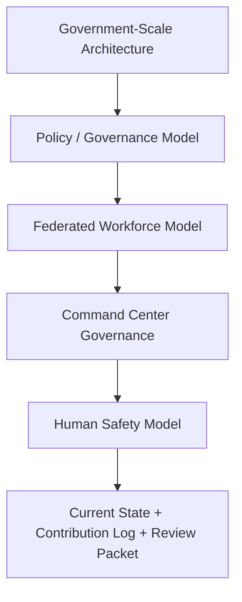

# BHIV Sampada — Task19 Review Packet

**Status**: Task19 boundary documents complete; Phase 6 support packaging in progress  
**Task19 Deliverables**: 5/5 primary docs created, current-state and contribution log updated  
**Maintained by**: Shashank (Sampada, Support Builder)  
**For Acceptance Review By**: Rishabh Yadav  
**Updated**: 2026-06-02

> **Operational Role**: Support Builder under Rishabh Yadav's leadership. Sampada remains an intelligence and visibility layer only. No execution authority is claimed here.

---

## 1. Government-Scale Architecture

The architecture boundary for Task19 is defined in [docs/SAMPADA_GOVERNMENT_SCALE_ARCHITECTURE.md](docs/SAMPADA_GOVERNMENT_SCALE_ARCHITECTURE.md).

### What it establishes
- Ministry, department, division, unit, office, and contractor/vendor participation levels
- Permanent, contractual, consultant, outsourced, volunteer, fellow, and advisor workforce scope
- Federated administration with local, department, platform, and auditor roles
- Tenant, org, visibility, and policy isolation boundaries

### Key rule
- Sampada must not collapse the multi-org model into a single global admin or a universal workforce state.

---

## 2. Policy / Governance Model

The governance model is defined in [docs/SAMPADA_POLICY_GOVERNANCE_MODEL.md](docs/SAMPADA_POLICY_GOVERNANCE_MODEL.md).

### Core rules
- Policy examples: leave, attendance, growth, visibility, consent, retention
- Governance verbs: observe, assess, recommend, approve, execute
- Required separation: observation ≠ assessment ≠ recommendation ≠ approval ≠ execution
- Enforcement patterns: policy tags, rule provenance, auditability, override recording, challenge pathways

### Key rule
- No hidden governance and no dashboard-level authority drift.

---

## 3. Federated Workforce Model

The federated identity and ontology model is defined in [docs/SAMPADA_FEDERATED_WORKFORCE_MODEL.md](docs/SAMPADA_FEDERATED_WORKFORCE_MODEL.md).

### Core rules
- Minimal shared workforce reference only
- Sampada owns growth, lifecycle, and workforce intelligence
- Niyantran owns execution telemetry
- Artha owns payroll truth
- Other systems participate only within bounded scopes
- Derived intelligence remains challengeable, not canonical truth

### Key rule
- No universal human-state model and no silent absorption of other systems' sovereignty.

---

## 4. Dashboard Governance Hardening

The command center governance model is defined in [docs/SAMPADA_COMMAND_CENTER_GOVERNANCE_MODEL.md](docs/SAMPADA_COMMAND_CENTER_GOVERNANCE_MODEL.md).

### Executive use cases
- Minister
- Secretary
- Department Head
- HR Operator
- Auditor

### Cognition separation
- Observation
- Assessment
- Recommendation
- Decision
- Execution

### Explainability surfaces
- Source visibility
- Calculation explanation
- Signal provenance

### Key rule
- The dashboard informs, but does not become legitimacy or execution authority.

---

## 5. Human Safety Framework

The safety model is defined in [docs/SAMPADA_HUMAN_SAFETY_MODEL.md](docs/SAMPADA_HUMAN_SAFETY_MODEL.md).

### Core principles
- Human dignity
- Explainability
- Bounded scoring
- Context awareness
- Assistive intelligence
- Reviewability

### Required controls
- Role-based visibility
- Org-scoped visibility
- Policy-scoped visibility
- Minimum necessary display
- Challenge and appeal paths

### Key rule
- No surveillance-style monitoring, opaque scoring, or coercive productivity ranking.

---

## 6. Boundary Protection

### Task19 constitutional boundaries
| Boundary | Protection |
|---|---|
| Visibility ≠ execution authority | Dashboards remain read-only by default |
| Policy ≠ hidden governance | All policy effects must be inspectable |
| Derived insight ≠ canonical truth | Provenance and source visibility remain mandatory |
| Aggregation ≠ sovereignty | Cross-system references preserve origin |
| Assistive intelligence ≠ coercion | Recommendations stay advisory until explicitly approved |

### Reinforced by
- [docs/SAMPADA_GOVERNMENT_SCALE_ARCHITECTURE.md](docs/SAMPADA_GOVERNMENT_SCALE_ARCHITECTURE.md)
- [docs/SAMPADA_POLICY_GOVERNANCE_MODEL.md](docs/SAMPADA_POLICY_GOVERNANCE_MODEL.md)
- [docs/SAMPADA_FEDERATED_WORKFORCE_MODEL.md](docs/SAMPADA_FEDERATED_WORKFORCE_MODEL.md)
- [docs/SAMPADA_COMMAND_CENTER_GOVERNANCE_MODEL.md](docs/SAMPADA_COMMAND_CENTER_GOVERNANCE_MODEL.md)
- [docs/SAMPADA_HUMAN_SAFETY_MODEL.md](docs/SAMPADA_HUMAN_SAFETY_MODEL.md)

---

## 7. SETU Alignment

### Alignment summary
- Sampada remains the intelligence layer inside SETU-connected operations.
- Niyantran remains the execution telemetry domain.
- Artha remains the payroll truth domain.
- SETU aggregation must not erase local ownership or policy context.

### Boundary note
- Payroll visibility participation does not become payroll ownership.
- Derived workforce intelligence remains challengeable and scoped.

### Existing reference material
- [docs/SAMPADA_CURRENT_STATE.md](docs/SAMPADA_CURRENT_STATE.md)
- [CONTRIBUTION_LOG.md](CONTRIBUTION_LOG.md)
- [docs/SAMPADA_SETU_CONVERGENCE_MAP.md](docs/SAMPADA_SETU_CONVERGENCE_MAP.md)

---

## 8. Risks

| # | Risk | Impact | Mitigation |
|---|---|---|---|
| R1 | Multi-org hierarchy collapses into a flat admin model | Critical | Keep ministry/department/division/unit/office boundaries explicit |
| R2 | Policy logic becomes hidden governance | High | Preserve policy source, scope, and override traceability |
| R3 | Derived dashboard insights are mistaken for authority | High | Show source visibility, calculation explanation, and provenance |
| R4 | Workforce truth becomes centralized in one layer | Critical | Maintain federated ownership across Sampada, Niyantran, Artha, and others |
| R5 | Safety controls drift into surveillance or coercion | High | Keep human dignity, explainability, bounded scoring, and reviewability explicit |

---

## 9. Roadmap

### Immediate
- Rishabh review of the five Task19 boundary docs
- Phase 6 direction setting for any live implementation support
- Final sign-off on this review packet

### Next
- If directed, perform implementation hardening support on schemas, API contracts, dashboard wiring, replay readiness, trace lineage, and ownership metadata
- Capture any new evidence or diagrams in the contribution log and supporting artifacts

### Later
- Extend the government-scale model into runtime enforcement where the lead approves it
- Reconcile any live implementation details back into the current-state handover

---

## 10. Proof / Evidence

### Created Task19 artifacts
- [docs/SAMPADA_GOVERNMENT_SCALE_ARCHITECTURE.md](docs/SAMPADA_GOVERNMENT_SCALE_ARCHITECTURE.md)
- [docs/SAMPADA_POLICY_GOVERNANCE_MODEL.md](docs/SAMPADA_POLICY_GOVERNANCE_MODEL.md)
- [docs/SAMPADA_FEDERATED_WORKFORCE_MODEL.md](docs/SAMPADA_FEDERATED_WORKFORCE_MODEL.md)
- [docs/SAMPADA_COMMAND_CENTER_GOVERNANCE_MODEL.md](docs/SAMPADA_COMMAND_CENTER_GOVERNANCE_MODEL.md)
- [docs/SAMPADA_HUMAN_SAFETY_MODEL.md](docs/SAMPADA_HUMAN_SAFETY_MODEL.md)

### Updated support artifacts
- [docs/SAMPADA_CURRENT_STATE.md](docs/SAMPADA_CURRENT_STATE.md)
- [CONTRIBUTION_LOG.md](CONTRIBUTION_LOG.md)

### Existing convergence evidence baseline
- `evidence/entry-points/`
- `evidence/trace-continuity/`
- `evidence/enforcement/`
- `evidence/replay/`
- `evidence/failure/`
- `evidence/boundaries/`
- `evidence/ownership/`
- `evidence/general/`
- `evidence/tests/`

### Diagram note
- Task19 boundary documents are textual controls; any runtime diagramming or replay evidence should be added only when Rishabh directs a live implementation support slice.

### Task19 boundary stack

---

*This review packet is maintained by the Sampada Support Builder role. All architectural decisions, acceptance criteria, and sign-off authority remain with Rishabh Yadav.*
