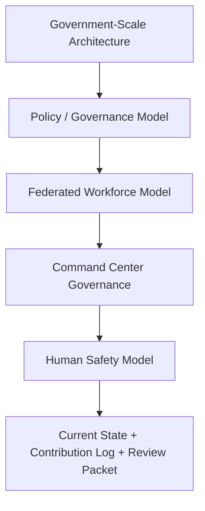

# BHIV Sampada — Task19 Review Packet

**Status**: Task19 boundary documents complete; runtime governance hardening complete; production health verified on Render (2026-06-03)  
**Task19 Deliverables**: 5/5 primary docs + live control center + E2E acceptance framework  
**Maintained by**: Shashank (Sampada, Support Builder)  
**For Acceptance Review By**: Rishabh Yadav  
**Updated**: 2026-06-03

> **Operational Role**: Support Builder under Rishabh Yadav's leadership. Sampada remains an intelligence and visibility layer only. No execution authority is claimed here.

---

## 1. Government-Scale Architecture

The architecture boundary for Task19 is defined in [docs/SAMPADA_GOVERNMENT_SCALE_ARCHITECTURE.md](docs/SAMPADA_GOVERNMENT_SCALE_ARCHITECTURE.md).

### What it establishes
- Ministry, department, division, unit, office, and contractor/vendor participation levels
- Permanent, contractual, consultant, outsourced, volunteer, fellow, and advisor workforce scope
- Federated administration with local, department, platform, and auditor roles
- Tenant, org, visibility, and policy isolation boundaries

### Key rule
- Sampada must not collapse the multi-org model into a single global admin or a universal workforce state.

---

## 2. Policy / Governance Model

The governance model is defined in [docs/SAMPADA_POLICY_GOVERNANCE_MODEL.md](docs/SAMPADA_POLICY_GOVERNANCE_MODEL.md).

### Core rules
- Policy examples: leave, attendance, growth, visibility, consent, retention
- Governance verbs: observe, assess, recommend, approve, execute
- Required separation: observation ≠ assessment ≠ recommendation ≠ approval ≠ execution
- Enforcement patterns: policy tags, rule provenance, auditability, override recording, challenge pathways

### Key rule
- No hidden governance and no dashboard-level authority drift.

---

## 3. Federated Workforce Model

The federated identity and ontology model is defined in [docs/SAMPADA_FEDERATED_WORKFORCE_MODEL.md](docs/SAMPADA_FEDERATED_WORKFORCE_MODEL.md).

### Core rules
- Minimal shared workforce reference only
- Sampada owns growth, lifecycle, and workforce intelligence
- Niyantran owns execution telemetry
- Artha owns payroll truth
- Other systems participate only within bounded scopes
- Derived intelligence remains challengeable, not canonical truth

### Key rule
- No universal human-state model and no silent absorption of other systems' sovereignty.

---

## 4. Dashboard Governance Hardening

The command center governance model is defined in [docs/SAMPADA_COMMAND_CENTER_GOVERNANCE_MODEL.md](docs/SAMPADA_COMMAND_CENTER_GOVERNANCE_MODEL.md).

### Executive use cases
- Minister
- Secretary
- Department Head
- HR Operator
- Auditor

### Cognition separation
- Observation
- Assessment
- Recommendation
- Decision
- Execution

### Explainability surfaces
- Source visibility
- Calculation explanation
- Signal provenance

### Key rule
- The dashboard informs, but does not become legitimacy or execution authority.

---

## 5. Human Safety Framework

The safety model is defined in [docs/SAMPADA_HUMAN_SAFETY_MODEL.md](docs/SAMPADA_HUMAN_SAFETY_MODEL.md).

### Core principles
- Human dignity
- Explainability
- Bounded scoring
- Context awareness
- Assistive intelligence
- Reviewability

### Required controls
- Role-based visibility
- Org-scoped visibility
- Policy-scoped visibility
- Minimum necessary display
- Challenge and appeal paths

### Key rule
- No surveillance-style monitoring, opaque scoring, or coercive productivity ranking.

---

## 6. Boundary Protection

### Task19 constitutional boundaries
| Boundary | Protection |
|---|---|
| Visibility ≠ execution authority | Dashboards remain read-only by default |
| Policy ≠ hidden governance | All policy effects must be inspectable |
| Derived insight ≠ canonical truth | Provenance and source visibility remain mandatory |
| Aggregation ≠ sovereignty | Cross-system references preserve origin |
| Assistive intelligence ≠ coercion | Recommendations stay advisory until explicitly approved |

### Reinforced by
- [docs/SAMPADA_GOVERNMENT_SCALE_ARCHITECTURE.md](docs/SAMPADA_GOVERNMENT_SCALE_ARCHITECTURE.md)
- [docs/SAMPADA_POLICY_GOVERNANCE_MODEL.md](docs/SAMPADA_POLICY_GOVERNANCE_MODEL.md)
- [docs/SAMPADA_FEDERATED_WORKFORCE_MODEL.md](docs/SAMPADA_FEDERATED_WORKFORCE_MODEL.md)
- [docs/SAMPADA_COMMAND_CENTER_GOVERNANCE_MODEL.md](docs/SAMPADA_COMMAND_CENTER_GOVERNANCE_MODEL.md)
- [docs/SAMPADA_HUMAN_SAFETY_MODEL.md](docs/SAMPADA_HUMAN_SAFETY_MODEL.md)

---

## 7. SETU Alignment

### Alignment summary
- Sampada remains the intelligence layer inside SETU-connected operations.
- Niyantran remains the execution telemetry domain.
- Artha remains the payroll truth domain.
- SETU aggregation must not erase local ownership or policy context.

### Boundary note
- Payroll visibility participation does not become payroll ownership.
- Derived workforce intelligence remains challengeable and scoped.

### Existing reference material
- [docs/SAMPADA_CURRENT_STATE.md](docs/SAMPADA_CURRENT_STATE.md)
- [CONTRIBUTION_LOG.md](CONTRIBUTION_LOG.md)
- [docs/SAMPADA_SETU_CONVERGENCE_MAP.md](docs/SAMPADA_SETU_CONVERGENCE_MAP.md)

---

## 8. Risks

| # | Risk | Impact | Mitigation |
|---|---|---|---|
| R1 | Multi-org hierarchy collapses into a flat admin model | Critical | Keep ministry/department/division/unit/office boundaries explicit |
| R2 | Policy logic becomes hidden governance | High | Preserve policy source, scope, and override traceability |
| R3 | Derived dashboard insights are mistaken for authority | High | Show source visibility, calculation explanation, and provenance |
| R4 | Workforce truth becomes centralized in one layer | Critical | Maintain federated ownership across Sampada, Niyantran, Artha, and others |
| R5 | Safety controls drift into surveillance or coercion | High | Keep human dignity, explainability, bounded scoring, and reviewability explicit |

---

## 9. Roadmap

### Complete (2026-06-03)
- Five Task19 boundary documents
- Live control center wiring (gateway governance module, audit replay, aggregates, scoped stats)
- Frontend `ControlCenter.tsx`: parallel `Promise.all` load, 30s silent refresh, policy scope UI
- Acceptance: `test_task19_control_center_governance.py`, `backend/tests/e2e/control_center/`
- Render production `/health` verified; Vercel deployment documented (`VITE_LANGGRAPH_SERVICE_URL`)
- Production API smoke script: 15/15 (`run_production_smoke.py`); prod audit write canary OK

### Immediate (acceptance)
- Rishabh review and sign-off on this review packet
- Manual: log in on Vercel → `/control` (bundle already contains Render URLs; confirm live cards in browser)
- Manual: JWT role matrix on prod with real client/recruiter/admin accounts (demo `TECH001` not in prod DB)

### Next (lead-directed)
- Extend `control_center_governance` patterns platform-wide (tenant isolation beyond control center)
- Runtime ministry→office hierarchy and policy engine only if approved
- Owner API integration (Niyantran/Artha) per SETU convergence map

### Later
- Staging/preview environment parity for control center
- Diagrams and additional replay evidence when directed

---

## 10. Proof / Evidence

### Task19 runtime evidence (2026-06-03)

| Requirement | Proof |
|-------------|-------|
| Policy-scope enforcement | `backend/services/gateway/app/control_center_governance.py`; scoped `/v1/candidates/stats`, `/metrics/dashboard` |
| Live audit read/replay | `GET /v1/control-center/audit-events`, `GET /v1/control-center/audit-replay` |
| Backend aggregates (funnel/dept) | `GET /v1/control-center/dashboard-aggregates` |
| Control center UI | `frontend/src/pages/control/ControlCenter.tsx` — live replay, parallel load, 30s silent refresh, policy scope strip |
| Correlation propagation | Gateway, Agent, LangGraph `X-Correlation-ID` middleware |
| LangGraph RL guard | `POST /rl/retrain` requires API key |
| E2E framework | `backend/tests/e2e/control_center/`, `docs/CONTROL_CENTER_E2E_TEST_FRAMEWORK.md` (8 pass / 2 skip localhost) |
| API contract + checklist | `docs/CENTRAL_CONTROL_API_CONTRACT_FREEZE.md`, `docs/CENTRAL_CONTROL_LIVE_EXECUTION_CHECKLIST.md` |
| Production health | Render gateway/agent/langgraph `/health` → 200 (2026-06-03) |
| Production API smoke | `run_production_smoke.py` — 15/15 (control-center APIs + Vercel bundles include Render hosts) |
| Vercel env contract | `VITE_LANGGRAPH_SERVICE_URL` (not `VITE_LANGGRAPH_URL`) — `frontend/VERCEL_DEPLOYMENT.md` |
| Executable acceptance | `docs/TASK19_ACCEPTANCE_TEST_PACK.md`, governance + E2E pytest |
| Requirement matrix | `docs/TASK19_REQUIREMENT_EVIDENCE_MATRIX.md` |

### Created Task19 artifacts
- [docs/SAMPADA_GOVERNMENT_SCALE_ARCHITECTURE.md](docs/SAMPADA_GOVERNMENT_SCALE_ARCHITECTURE.md)
- [docs/SAMPADA_POLICY_GOVERNANCE_MODEL.md](docs/SAMPADA_POLICY_GOVERNANCE_MODEL.md)
- [docs/SAMPADA_FEDERATED_WORKFORCE_MODEL.md](docs/SAMPADA_FEDERATED_WORKFORCE_MODEL.md)
- [docs/SAMPADA_COMMAND_CENTER_GOVERNANCE_MODEL.md](docs/SAMPADA_COMMAND_CENTER_GOVERNANCE_MODEL.md)
- [docs/SAMPADA_HUMAN_SAFETY_MODEL.md](docs/SAMPADA_HUMAN_SAFETY_MODEL.md)

### Updated support artifacts
- [docs/SAMPADA_CURRENT_STATE.md](docs/SAMPADA_CURRENT_STATE.md)
- [CONTRIBUTION_LOG.md](CONTRIBUTION_LOG.md)

### Existing convergence evidence baseline
- `evidence/entry-points/`
- `evidence/trace-continuity/`
- `evidence/enforcement/`
- `evidence/replay/`
- `evidence/failure/`
- `evidence/boundaries/`
- `evidence/ownership/`
- `evidence/general/`
- `evidence/tests/`

### Open runtime evidence (not blocking doc acceptance)
- Production UI smoke on Vercel `/control` (JWT matrix, scoped stats on prod data)
- Full government org hierarchy and policy engine in runtime (constitutional docs only today)
- Platform-wide tenant isolation beyond control-center endpoints

### Task19 boundary stack

---

*This review packet is maintained by the Sampada Support Builder role. All architectural decisions, acceptance criteria, and sign-off authority remain with Rishabh Yadav.*
