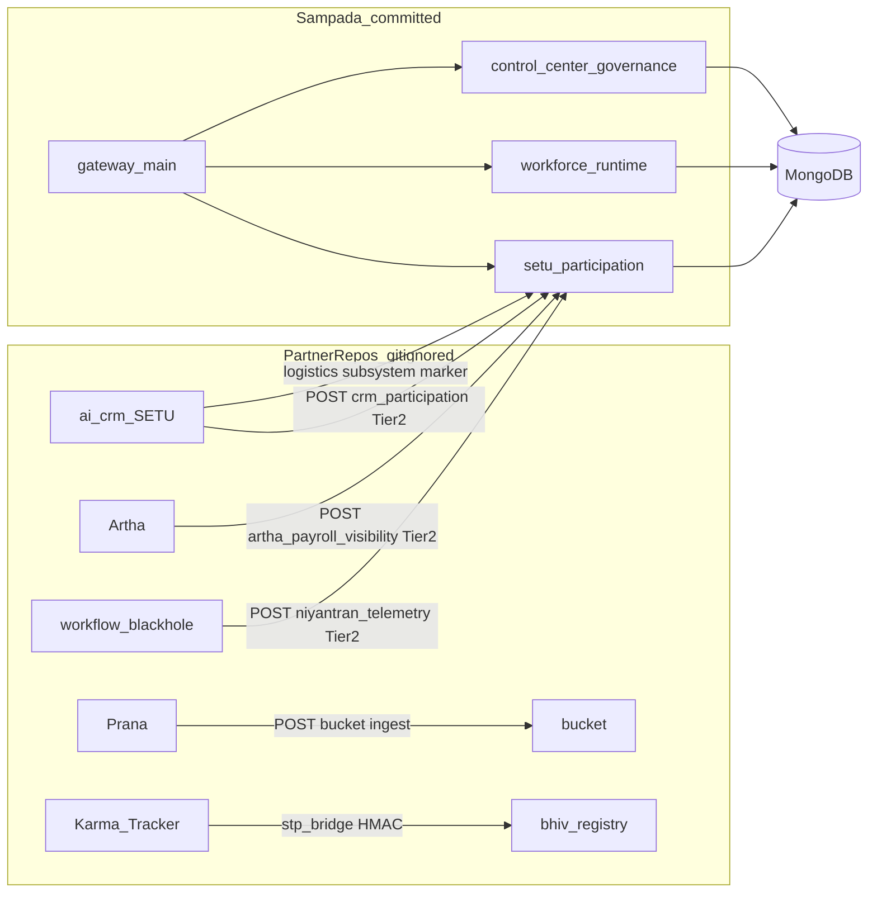

# Runtime Dependency Graph — BHIV Phase IV

**Date:** 2026-07-13  
**Rule:** Edges shown are **verified in code or evidence** only — no assumed integrations.

---

## Mermaid diagram

---

## Verified HTTP edges

| From | To | Endpoint pattern | Evidence |
|---|---|---|---|
| Artha dispatcher | Sampada live | `POST /v1/setu/signals/artha_payroll_visibility` | `sig-66c8d789c660` (20260713T035150Z) |
| CRM dispatcher | Sampada live | `POST /v1/setu/signals/crm_participation` | `sig-5f80c230999c` |
| CRM dispatcher (logistics) | Sampada live | same + `payload.subsystem` | `sig-8ae9c683f2ef` |
| Niyantran dispatcher | Sampada live | `POST /v1/setu/signals/niyantran_telemetry` | Prior sprint `sig-29f9efbb899a`; Phase IV blocked |
| Control Center UI | Sampada gateway | `/v1/control-center/*`, `/v1/workforce/*`, `/v1/setu/*` | `ControlCenter.tsx` + offline tests |
| PRANA | Bucket | `/api/v1/bucket/prana/ingest` | Implementation.md §3.5 |
| Karma | InsightFlow | `/api/v1/insightflow/receive` | `stp_bridge.py` |

---

## Missing edges (documented gaps)

- Bucket → Sampada: **none**
- InsightFlow → Sampada: **none**
- Karma → Sampada: **none**
- PRANA → Sampada: **none**

Route unresolved integrations to **GC** (authority) and **MDU** (schema/provenance).
