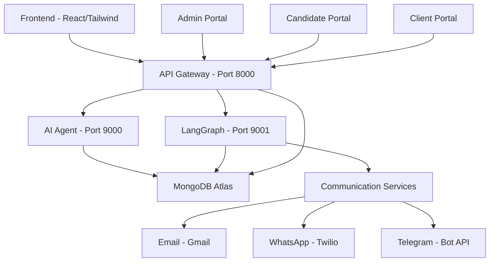

# BHIV HR Platform - Backend

**Enterprise AI-Powered Recruiting Platform - Complete Backend Reference Guide**

---

## 📊 System Overview

| Metric | Value |
|--------|-------|
| **Platform Version** | v4.3.0 |
| **Last Updated** | January 22, 2026 |
| **Services** | 3 Core Microservices (Gateway, Agent, LangGraph) |
| **Total Endpoints** | 111 (80 Gateway + 6 Agent + 25 LangGraph) |
| **Database** | MongoDB Atlas (fully migrated from PostgreSQL) |
| **Security Rating** | A+ |
| **Status** | ✅ Production Ready |
| **Architecture** | Multi-tenant SaaS with AI/ML integration |
| **Deployment** | Docker + Render Cloud + Vercel Frontend |

---

## 🏗️ Complete Backend Architecture

The BHIV HR Platform backend implements a modern microservices architecture designed for enterprise-scale AI-powered recruitment processes. The system follows a clean separation of concerns with specialized services handling distinct responsibilities while maintaining cohesive integration through well-defined APIs and shared components.

### Core Architecture Principles

- **Microservices Design**: Independent, loosely-coupled services with single responsibilities
- **API-First Approach**: Well-documented RESTful APIs with OpenAPI/Swagger documentation
- **Multi-Tenant SaaS**: Complete tenant isolation with role-based access control
- **AI/ML Integration**: Advanced semantic matching and reinforcement learning capabilities
- **Event-Driven**: Asynchronous processing and real-time updates
- **Cloud-Native**: Containerized deployment with horizontal scalability
- **Security-First**: Comprehensive authentication, authorization, and data protection

### System Components Overview



## 📊 System Overview

| Metric | Value |
|--------|-------|
| **Platform Version** | v4.3.0 |
| **Last Updated** | January 22, 2026 |
| **Services** | 3 Core Microservices (Gateway, Agent, LangGraph) |
| **Total Endpoints** | 111 (80 Gateway + 6 Agent + 25 LangGraph) |
| **Database** | MongoDB Atlas (fully migrated from PostgreSQL) |
| **Security Rating** | A+ |
| **Status** | ✅ Production Ready |
| **Architecture** | Multi-tenant SaaS with AI/ML integration |
| **Deployment** | Docker + Render Cloud + Vercel Frontend |

---

## 🌐 Service Architecture & Communication

### Core Service Mapping

| Service | Port | Endpoints | Purpose | Health Check | Documentation |
|---------|------|-----------|---------|--------------|---------------|
| **API Gateway** | 8000 | 77+ | Main API entry point, authentication, orchestration | `/health` | `/docs` |
| **AI Agent** | 9000 | 6 | Semantic matching, ML predictions, batch processing | `/health` | `/docs` |
| **LangGraph** | 9001 | 25 | Workflow automation, RL integration, multi-channel communication | `/health` | `/docs` |

### Service Communication Patterns

**Inter-Service Communication:**
- **HTTP/REST**: Primary communication protocol between services
- **API Key Authentication**: Service-to-service authentication using shared secrets
- **Shared Database**: MongoDB Atlas as central data repository
- **Event-Driven**: Asynchronous processing with webhook patterns
- **Health Monitoring**: Continuous health checks and service discovery

**Data Flow Architecture:**
```
Frontend → API Gateway → [AI Agent, LangGraph] → MongoDB Atlas
                              ↓
                    Communication Services (Email/WhatsApp/Telegram)
```

### Service Dependencies & Orchestration

**Gateway Service Dependencies:**
- MongoDB Atlas for data persistence
- Agent Service for AI matching capabilities  
- LangGraph for workflow automation
- External services (Gmail, Twilio, Telegram)

**Agent Service Dependencies:**
- MongoDB Atlas for job and candidate data
- Semantic models (all-MiniLM-L6-v2) for embeddings
- Gateway service for authentication and coordination

**LangGraph Service Dependencies:**
- MongoDB Atlas for workflow state and RL data
- Gateway service for data access
- Agent service for AI predictions
- Communication services for notifications
- Google Gemini API for advanced processing

---

## 📁 Complete Backend Directory Structure

### Root Directory Components

```
backend/
├── .env.example                    # Environment variables template
├── .gitignore                     # Git ignore rules
├── README.md                      # Main documentation
├── check_services.bat             # Windows service health checker
├── comprehensive_test_results.json # Test results from integration tests
├── docker-compose.production.yml  # Production Docker Compose
├── requirements.txt               # Core Python dependencies
├── run_services.py                # Main service orchestration script
├── run_test_simple.py             # Basic test runner
├── run_with_venv.bat             # Windows venv + service runner
├── seed_mongodb.py               # Database seeding script
├── setup_venv.bat                # Windows virtual environment setup
├── test_mongodb_atlas.py         # MongoDB connection tester
├── test_mongodb_setup.py         # MongoDB setup validation
├── MONGODB_VERIFICATION_REPORT.md # MongoDB connection report
├── __pycache__/                  # Python bytecode cache
├── Ishan's_AI_HR_System-main/    # Legacy AI system (reference only)
├── Task/                         # Task documentation files
├── assets/                       # Static assets and data
├── docs/                         # Comprehensive documentation
├── handover/                     # Handover documentation
├── runtime-core/                 # Legacy framework (reference only)
├── scripts/                      # Utility scripts
├── services/                     # Core microservices
├── tests/                        # Comprehensive test suites
├── tools/                        # Development and operational tools
├── validation/                   # Validation scripts
└── venv/                         # Virtual environment (if exists)
```

### Services Directory Structure

```
services/
├── agent/                        # AI Agent Service (Port 9000)
│   ├── Dockerfile               # Container configuration
│   ├── README.md                # Service documentation
│   ├── app.py                   # Main FastAPI application
│   ├── database.py              # MongoDB connection management
│   ├── jwt_auth.py              # Authentication utilities
│   ├── requirements.txt         # Service-specific dependencies
│   └── semantic_engine/         # AI/ML semantic matching module
│       ├── __init__.py
│       └── phase3_engine.py
├── gateway/                      # API Gateway Service (Port 8000)
│   ├── Dockerfile               # Container configuration
│   ├── README.md                # Service documentation
│   ├── app/                     # FastAPI application
│   │   ├── __init__.py
│   │   ├── database.py          # MongoDB async connection
│   │   ├── db_helpers.py        # MongoDB utility functions
│   │   ├── main.py              # Main application (77+ endpoints)
│   │   └── monitoring.py        # Monitoring utilities
│   ├── config.py                # Configuration management
│   ├── docker-compose.yml       # Service-specific compose
│   ├── jwt_auth.py              # JWT authentication
│   ├── langgraph_integration.py # LangGraph service integration
│   ├── monitoring.py            # Advanced monitoring
│   ├── requirements.txt         # Service-specific dependencies
│   └── routes/                  # Modular route definitions
├── langgraph/                    # LangGraph Service (Port 9001)
│   ├── Dockerfile               # Container configuration
│   ├── README.md                # Service documentation
│   ├── app/                     # FastAPI + LangGraph application
│   │   ├── __init__.py
│   │   ├── app.py               # Main application (25 endpoints)
│   │   ├── communication/       # Multi-channel communication
│   │   ├── config.py            # Configuration
│   │   ├── database.py          # MongoDB connection
│   │   ├── mongodb_tracker.py   # Workflow tracking
│   │   ├── rl_database.py       # RL data management
│   │   ├── rl_integration/      # RL components
│   │   ├── semantic_matcher.py  # Semantic matching
│   │   └── workflows/           # Workflow definitions
│   ├── config.py                # Pydantic configuration
│   ├── dependencies.py          # Authentication dependencies
│   ├── docker-compose.yml       # Service-specific compose
│   ├── jwt_auth.py              # JWT authentication
│   ├── requirements.txt         # Service-specific dependencies
│   └── tests/                   # Integration tests
└── [Additional services...]      # Portal and supporting services
```

### Documentation Directory Structure

```
docs/
├── README.md                    # Documentation overview
├── analysis/                    # Code analysis reports
│   ├── CODE_QUALITY_ANALYSIS.md
│   └── COMPREHENSIVE_CODEBASE_ANALYSIS.md
├── api/                         # API documentation
│   └── API_CONTRACT.md
├── architecture/                # System architecture
│   ├── ARCHITECTURE.md
│   ├── SERVICE_DEPENDENCY_GRAPH.md
│   └── SYSTEM_ARCHITECTURE.md
├── database/                    # Database documentation
│   ├── DATABASE_DOCUMENTATION.md
│   ├── DATABASE_SCHEMA.md
│   ├── MONGODB_ATLAS_SETUP.md
│   ├── MONGODB_COLLECTIONS.md
│   ├── POSTGRES_MIGRATION_PLAN.md
│   └── MONGODB_VERIFICATION_REPORT.md
├── guides/                      # Development guides
│   ├── AUTHENTICATION_FLOW.md
│   ├── BACKEND_INTEGRATION_GUIDE.md
│   ├── CLOUD_DEPLOYMENT_GUIDE.md
│   ├── DEBUGGING_GUIDE.md
│   ├── DEVELOPER_ONBOARDING.md
│   ├── ENVIRONMENT_SETUP.md
│   ├── FRONTEND_INTEGRATION_GUIDE.md
│   ├── GATEWAY_SERVICE_GUIDE.md
│   ├── SERVICES_GUIDE.md
│   ├── SSL_CERTIFICATE_SETUP.md
│   └── TROUBLESHOOTING_GUIDE.md
├── security/                    # Security documentation
│   ├── API_SECURITY.md
│   ├── AUTHENTICATION_SECURITY.md
│   ├── SECURITY_AUDIT.md
│   └── SECURITY_IMPLEMENTATION.md
└── testing/                     # Testing documentation
    ├── COMPREHENSIVE_TESTING_STRATEGY.md
    ├── ENDPOINT_TESTING.md
    └── TESTING_APPROACH.md
```

### Testing Directory Structure

```
tests/
├── README.md                    # Test suite documentation
├── agent/                       # Agent service tests
├── api/                         # API endpoint tests
├── database/                    # Database integration tests
├── deployment/                  # Deployment validation tests
├── fixes/                       # Fix verification tests
├── gateway/                     # Gateway service tests
├── integration/                 # Cross-service integration tests
├── langgraph/                   # LangGraph service tests
├── misc/                        # Miscellaneous tests
├── portal/                      # Portal service tests
├── rl_integration/              # RL integration tests
├── security/                    # Security tests
├── validation/                  # Validation tests
├── workflows/                   # Workflow tests
├── comprehensive_endpoint_tests.py # Complete endpoint test suite
├── fix_postman_collection.py    # Postman collection fixer
└── requirements.txt             # Test dependencies
```

### Tools Directory Structure

```
tools/
├── README.md                    # Tools documentation
├── analysis/                    # Code analysis tools
├── data/                        # Data management tools
├── database/                    # Database tools
├── fixes/                       # Fix tools
├── monitoring/                  # Monitoring tools
├── portal/                      # Portal tools
├── security/                    # Security tools
├── utilities/                   # General utilities
├── requirements.txt             # Tool dependencies
└── setup_advanced_tools.py      # Advanced tool setup
```

## 🚀 Comprehensive Setup Guide

### Prerequisites

**Development Environment:**
- **Python 3.12+** - [Download](https://www.python.org/downloads/)
- **Node.js 18+** - [Download](https://nodejs.org/)
- **MongoDB Atlas Account** - [Sign Up](https://www.mongodb.com/cloud/atlas/register)
- **Git** - [Download](https://git-scm.com/downloads/)
- **Docker Desktop** (Recommended for containerized deployment)

**Optional Development Tools:**
- **VS Code** with Python extension
- **Postman** for API testing
- **MongoDB Compass** for database visualization
- **Redis CLI** for caching operations (legacy reference)

### 📝 Complete Setup Process

#### Option 1: Quick Start Script (Windows)
```bash
# Clone repository
git clone <repository-url>
cd Infiverse-HR

# Run both backend and frontend
run_project.bat
```

#### Option 2: Manual Setup

**Terminal 1 - Backend Setup:**
```bash
cd Infiverse-HR/backend
python -m venv venv
venv\Scripts\activate  # Windows
# source venv/bin/activate  # Linux/Mac
pip install -r requirements.txt
# Configure .env file (see environment configuration below)
python run_services.py
```

**Terminal 2 - Frontend Setup:**
```bash
cd Infiverse-HR/frontend
npm install
# Configure .env file (see frontend setup below)
npm run dev
```

**Access the application:**
- **Frontend:** http://localhost:3000
- **Backend API:** http://localhost:8000/docs

### 📦 Alternative Setup Methods

#### Method 1: Python Virtual Environment (Recommended)
```bash
# Clone repository
git clone <repository-url>
cd Infiverse-HR/backend

# Create virtual environment
python -m venv venv
source venv/bin/activate  # Linux/Mac
# venv\Scripts\activate  # Windows

# Install dependencies
pip install -r requirements.txt

# Configure environment
cp .env.example .env  # Linux/Mac
# copy .env.example .env  # Windows

# Edit .env with your values
# Start services
python run_services.py
```

#### Method 2: Docker Compose (All Services)
```bash
# Clone repository
git clone <repository-url>
cd Infiverse-HR/backend

# Configure environment
cp .env.example .env
# Edit .env with your MongoDB connection and secrets

# Start all services(detact mode)
docker-compose -f docker-compose.production.yml up -d --build

# Stop all services
docker-compose -f docker-compose.production.yml down

# View logs
docker-compose -f docker-compose.production.yml logs -f
```

#### Method 3: Individual Service Development
```bash
# Terminal 1 - Gateway Service
cd Infiverse-HR/backend/services/gateway
uvicorn app.main:app --host 0.0.0.0 --port 8000 --reload

# Terminal 2 - AI Agent Service
cd Infiverse-HR/backend/services/agent
uvicorn app:app --host 0.0.0.0 --port 9000 --reload

# Terminal 3 - LangGraph Service
cd Infiverse-HR/backend/services/langgraph
uvicorn app.main:app --host 0.0.0.0 --port 9001 --reload
```

### 🛠️ Development Environment Setup

**Windows Development Setup:**
```bash
# Clone repository
git clone <repository-url>
cd Infiverse-HR

# Set up backend
cd backend
setup_venv.bat

# Run backend services
run_with_venv.bat

# Set up frontend (in separate terminal)
cd ../frontend
npm install
npm run dev
```

**Linux/Mac Development Setup:**
```bash
# Clone repository
git clone <repository-url>
cd Infiverse-HR

# Set up backend
cd backend
python3 -m venv venv
source venv/bin/activate
pip install -r requirements.txt

# Run backend services
python run_services.py

# Set up frontend (in separate terminal)
cd ../frontend
npm install
npm run dev
```

**Verification Steps:**
```bash
# Check service health
curl http://localhost:8000/health
curl http://localhost:9000/health
curl http://localhost:9001/health

# Verify API documentation
# Gateway: http://localhost:8000/docs
# Agent: http://localhost:9000/docs
# LangGraph: http://localhost:9001/docs
```

---

## 🛠️ Configuration Requirements

### Environment Variables

The system requires comprehensive configuration through environment variables. All services share a common configuration approach using `.env` files.

#### Core Environment Variables

**Database Configuration:**
```env
# MongoDB Atlas Connection String
DATABASE_URL=mongodb+srv://<username>:<password>@<cluster>.mongodb.net/<dbname>

# Database Name (optional, defaults to bhiv_hr)
MONGODB_DB_NAME=bhiv_hr
```

**Authentication Secrets:**
```env
# Primary API Key for service-to-service communication
API_KEY_SECRET=<your-api-key>

# JWT Secret for general authentication (client users)
JWT_SECRET_KEY=<your-jwt-secret>

# JWT Secret specifically for candidate authentication
CANDIDATE_JWT_SECRET_KEY=<your-candidate-jwt-secret>

# Gateway service authentication
GATEWAY_SECRET_KEY=<your-gateway-secret>
```

**Service URLs:**
```env
# Local development URLs
GATEWAY_SERVICE_URL=http://localhost:8000
AGENT_SERVICE_URL=http://localhost:9000
LANGGRAPH_SERVICE_URL=http://localhost:9001

# Production URLs (will be auto-populated on Render)
RENDER_EXTERNAL_URL=<auto-set-by-render>
```

**AI/ML Services:**
```env
# Google Gemini API for advanced AI features
GEMINI_API_KEY=<your-gemini-key>

# OpenAI API (alternative provider)
OPENAI_API_KEY=<your-openai-key>
```

**Communication Services:**
```env
# Gmail SMTP for Email Notifications
GMAIL_EMAIL=<your-email>
GMAIL_APP_PASSWORD_SECRET_KEY=<your-app-password>

# Twilio for WhatsApp/SMS Notifications
TWILIO_ACCOUNT_SID=<your-twilio-sid>
TWILIO_AUTH_TOKEN_SECRET_KEY=<your-twilio-token>
TWILIO_WHATSAPP_NUMBER=<your-whatsapp-number>

# Telegram Bot for Telegram Notifications
TELEGRAM_BOT_TOKEN_SECRET_KEY=<your-telegram-token>
```

**System Configuration:**
```env
# Environment (development/production)
ENVIRONMENT=development

# Logging level
LOG_LEVEL=INFO

# Performance Settings
MAX_CANDIDATES_PER_REQUEST=50
AI_MATCHING_TIMEOUT=15

# Rate Limiting Configuration
RATE_LIMIT_DEFAULT=60
RATE_LIMIT_PREMIUM=300
RATE_LIMIT_ENTERPRISE=500

# Security Configuration
MAX_LOGIN_ATTEMPTS=5
LOCKOUT_DURATION_MINUTES=30
JWT_EXPIRATION_HOURS=24
MIN_PASSWORD_LENGTH=8
REQUIRE_PASSWORD_COMPLEXITY=true
```

#### Environment Generation

**Generate Secure Secrets:**
```bash
# Generate API Key
python -c "import secrets; print('API_KEY_SECRET=' + secrets.token_urlsafe(32))"

# Generate JWT Secret
python -c "import secrets; print('JWT_SECRET_KEY=' + secrets.token_urlsafe(32))"

# Generate Candidate JWT Secret
python -c "import secrets; print('CANDIDATE_JWT_SECRET_KEY=' + secrets.token_urlsafe(32))"

# Generate Gateway Secret
python -c "import secrets; print('GATEWAY_SECRET_KEY=' + secrets.token_urlsafe(32))"
```

#### Configuration Best Practices

**Security Best Practices:**
- Never commit `.env` files to version control
- Use different secrets for development/staging/production
- Rotate secrets regularly (recommended every 90 days)
- Store secrets securely using environment variables
- Use strong, randomly generated secrets

**Performance Optimization:**
- Adjust rate limiting based on expected traffic
- Configure timeouts based on system capabilities
- Optimize database connection pooling settings
- Set appropriate memory and CPU limits for containers

**Development Configuration:**
- Use development environment settings during development
- Enable detailed logging for debugging
- Configure appropriate timeout values for local development
- Set up proper CORS settings for frontend integration

---

## 🎨 Service-Specific Setup

### Gateway Service Configuration

**Location:** `services/gateway/`

**Key Features:**
- Central API gateway for all requests
- Authentication and authorization
- Service orchestration
- Monitoring and health checks
- Security features (rate limiting, input validation)

**Configuration:**
```bash
# Navigate to gateway service
cd services/gateway

# Install service-specific dependencies
pip install -r requirements.txt

# Start the service
uvicorn app.main:app --host 0.0.0.0 --port 8000 --reload
```

### AI Agent Service Configuration

**Location:** `services/agent/`

**Key Features:**
- AI-powered semantic candidate matching
- Batch processing capabilities
- Company-specific learning
- Cultural fit analysis
- Real-time analysis

**Configuration:**
```bash
# Navigate to agent service
cd services/agent

# Install service-specific dependencies
pip install -r requirements.txt

# Start the service
uvicorn app:app --host 0.0.0.0 --port 9000 --reload
```

### LangGraph Service Configuration

**Location:** `services/langgraph/`

**Key Features:**
- Workflow orchestration
- Reinforcement learning integration
- Multi-channel communication
- Real-time updates
- Performance monitoring

**Configuration:**
```bash
# Navigate to langgraph service
cd services/langgraph

# Install service-specific dependencies
pip install -r requirements.txt

# Start the service
uvicorn app.main:app --host 0.0.0.0 --port 9001 --reload
```

---

### Method 2: Docker Compose (All Services)

#### Step 1: Clone Repository
```bash
git clone <repository-url>
cd Infiverse-HR/backend
```

#### Step 2: Configure Environment
```bash
# Windows
copy .env.example .env

# Linux/Mac
cp .env.example .env
```

Edit `.env` with your MongoDB connection and secrets (same as Method 1).

#### Step 3: Start All Services with Docker
```bash
docker-compose -f docker-compose.production.yml up --build
```

**Run in background (detached mode):**
```bash
docker-compose -f docker-compose.production.yml up -d
```

#### Step 4: View Logs
```bash
# View all logs
docker-compose -f docker-compose.production.yml logs -f

# View specific service logs
docker-compose -f docker-compose.production.yml logs -f gateway
docker-compose -f docker-compose.production.yml logs -f agent
docker-compose -f docker-compose.production.yml logs -f langgraph
```

#### Step 5: Verify Services
```bash
curl http://localhost:8000/health
curl http://localhost:9000/health
curl http://localhost:9001/health
```

#### Step 6: Stop Services
```bash
# Stop services
docker-compose -f docker-compose.production.yml down

# Stop and remove volumes
docker-compose -f docker-compose.production.yml down -v
```

---

## 🎨 Frontend Integration

**Complete frontend integration with React TypeScript and multi-portal system**

### Frontend Architecture

**Multi-Portal System:**
- **Recruiter Console:** Job management, candidate review, feedback
- **Candidate Portal:** Profile management, applications, interview scheduling
- **Client View:** Analytics, shortlist review, approvals and decision making

**Technology Stack:**
- **Frontend Framework:** React 18 with TypeScript
- **Build Tool:** Vite for fast development and builds
- **Styling:** Tailwind CSS for responsive design
- **Routing:** React Router for navigation
- **API Communication:** Axios for HTTP requests
- **State Management:** Context API for global state

### Frontend Setup Process

#### Complete Frontend Setup
```bash
# Navigate to frontend directory
cd Infiverse-HR/frontend

# Install dependencies
npm install

# Configure environment
cp .env.example .env  # Linux/Mac
# copy .env.example .env  # Windows

# Edit .env file
# VITE_API_BASE_URL=http://localhost:8000

# Start development server
npm run dev
```

### Frontend Configuration

**Environment Variables:**
```env
# API Base URL for backend services
VITE_API_BASE_URL=http://localhost:8000

# Frontend-specific configurations
VITE_APP_TITLE=BHIV HR Platform
VITE_API_TIMEOUT=30000
VITE_FILE_UPLOAD_MAX_SIZE=10485760  # 10MB in bytes
```

**API Integration Points:**
- **Gateway Service:** Primary API endpoint for authentication and data
- **Agent Service:** AI matching results and analysis
- **LangGraph Service:** Workflow status and communication updates

### Frontend-Backend Communication

**API Communication Patterns:**
- **RESTful APIs:** Standard HTTP methods for data operations
- **JWT Authentication:** Secure token-based authentication
- **Real-time Updates:** WebSocket connections for live updates
- **File Uploads:** Multi-part form data for resume uploads
- **Batch Operations:** Bulk operations for efficiency

**Integration Endpoints:**
- **Authentication:** Login, registration, 2FA
- **Job Management:** Creation, listing, updates, deletion
- **Candidate Management:** Profiles, applications, interviews
- **AI Matching:** Semantic matching results and analysis
- **Workflows:** Status updates and communication logs

---

## 🔧 Backend Scripts Reference

### Core Service Scripts

| Script | Purpose | Usage |
|--------|---------|-------|
| `run_services.py` | Start all or specific services | `python run_services.py [gateway\|agent\|langgraph]` |
| `setup_venv.bat` | Create venv & install packages (Windows) | `setup_venv.bat` |
| `run_with_venv.bat` | Activate venv & run services (Windows) | `run_with_venv.bat` |
| `seed_mongodb.py` | Seed database with sample data | `python seed_mongodb.py` |
| `test_mongodb_atlas.py` | Test MongoDB connection | `python test_mongodb_atlas.py` |
| `check_services.bat` | Check service health (Windows) | `check_services.bat` |

### Database Management Scripts

| Script | Purpose | Usage |
|--------|---------|-------|
| `services/gateway/verify_mongodb_schema.py` | Verify MongoDB schema and collections | `python services/gateway/verify_mongodb_schema.py` |
| `services/gateway/create_mongodb_indexes.py` | Create recommended MongoDB indexes | `python services/gateway/create_mongodb_indexes.py` |
| `services/gateway/migrate_mongodb_schema.py` | Migrate existing MongoDB data (add role fields) | `python services/gateway/migrate_mongodb_schema.py` |

### Testing Scripts

| Script | Purpose | Usage |
|--------|---------|-------|
| `test_authentication_changes.py` | Test authentication flows (candidate, recruiter, client) | `python test_authentication_changes.py` |
| `test_mongodb_scripts.py` | Test MongoDB schema management scripts | `python test_mongodb_scripts.py` |

**Quick Test Commands:**
```bash
# Test authentication flows
python test_authentication_changes.py

# Test MongoDB scripts
python test_mongodb_scripts.py

# Verify MongoDB schema
python services/gateway/verify_mongodb_schema.py

# Create MongoDB indexes
python services/gateway/create_mongodb_indexes.py

# Migrate MongoDB schema
python services/gateway/migrate_mongodb_schema.py
```

### Utility Scripts

**Development Utilities:**
- `seed_mongodb.py`: Populate database with sample data
- `test_mongodb_atlas.py`: Test MongoDB connection
- `test_mongodb_setup.py`: Test MongoDB setup
- `check_services.bat`: Check service health on Windows
- `setup_venv.bat`: Windows virtual environment setup
- `run_with_venv.bat`: Run services with virtual environment

**Database Utilities:**
- `verify_mongodb_schema.py`: Verify schema integrity
- `create_mongodb_indexes.py`: Create performance indexes
- `migrate_mongodb_schema.py`: Schema migration tools

**Testing Utilities:**
- `test_authentication_changes.py`: Authentication testing
- `test_mongodb_scripts.py`: Database testing
- `comprehensive_endpoint_tests.py`: Complete endpoint testing

---

## 📁 Project Structure Deep Dive

### Root Level Components

- **`.env.example`**: Template with all required environment variables for database connections, API keys, and service configurations
- **`.gitignore`**: Specifies files to ignore, including environment files, cache directories, and local configurations
- **`README.md`**: Main documentation with setup instructions and architecture overview
- **`check_services.bat`**: Windows script for verifying service health
- **`comprehensive_test_results.json`**: JSON file with integration test results for CI/CD
- **`docker-compose.production.yml`**: Production Docker Compose for containerized deployment
- **`requirements.txt`**: Python dependencies for backend services
- **`run_services.py`**: Main orchestration script for starting services
- **`run_test_simple.py`**: Lightweight test runner for basic verification
- **`run_with_venv.bat`**: Windows script to activate venv and start services
- **`seed_mongodb.py`**: Script to populate MongoDB with sample data
- **`setup_venv.bat`**: Windows script for virtual environment setup
- **`test_mongodb_atlas.py`**: Test script for MongoDB Atlas connectivity
- **`test_mongodb_setup.py`**: Comprehensive MongoDB connection testing
- **`MONGODB_VERIFICATION_REPORT.md`**: Detailed MongoDB connection test report
- **`__pycache__`**: Python bytecode cache directory

### Services Directory Deep Dive

**Gateway Service (`services/gateway/`):**
- **Purpose**: Main API entry point, authentication, orchestration
- **Endpoints**: 77+ endpoints for jobs, candidates, AI integration, security
- **Technology**: FastAPI, MongoDB, JWT authentication
- **Key Files**: `app/main.py`, `jwt_auth.py`, `routes/`, `database.py`

**Agent Service (`services/agent/`):**
- **Purpose**: AI-powered semantic matching and analysis
- **Endpoints**: 6 endpoints for candidate matching and analysis
- **Technology**: FastAPI, Sentence Transformers, PyTorch
- **Key Files**: `app.py`, `semantic_engine/`, `database.py`

**LangGraph Service (`services/langgraph/`):**
- **Purpose**: Workflow automation, RL integration, communication
- **Endpoints**: 25 endpoints for workflows, RL, communication
- **Technology**: FastAPI, LangGraph, LangChain, Google Gemini
- **Key Files**: `app/main.py`, `workflows/`, `communication/`, `rl_integration/`

### Documentation Structure

**Analysis Documentation (`docs/analysis/`):**
- Code quality analysis reports
- Comprehensive codebase analysis
- Performance and security assessments

**API Documentation (`docs/api/`):**
- Complete API contract documentation
- Endpoint specifications and schemas
- Integration guides and examples

**Architecture Documentation (`docs/architecture/`):**
- System architecture diagrams
- Service dependency graphs
- Design patterns and decisions

**Database Documentation (`docs/database/`):**
- MongoDB Atlas setup guides
- Collection schemas and relationships
- Migration plans and verification

**Security Documentation (`docs/security/`):**
- Authentication flow documentation
- Security implementation details
- Audit and compliance requirements

**Testing Documentation (`docs/testing/`):**
- Comprehensive testing strategies
- Test approach and methodology
- Endpoint testing procedures

## 🔧 Backend Scripts Reference

| Script | Purpose | Usage |
|--------|---------|-------|
| `run_services.py` | Start all or specific services | `python run_services.py [gateway\|agent\|langgraph]` |
| `setup_venv.bat` | Create venv & install packages (Windows) | `setup_venv.bat` |
| `run_with_venv.bat` | Activate venv & run services (Windows) | `run_with_venv.bat` |
| `seed_mongodb.py` | Seed database with sample data | `python seed_mongodb.py` |
| `test_mongodb_atlas.py` | Test MongoDB connection | `python test_mongodb_atlas.py` |
| `check_services.bat` | Check service health (Windows) | `check_services.bat` |

### 🧪 Testing Scripts

| Script | Purpose | Usage |
|--------|---------|-------|
| `test_authentication_changes.py` | Test authentication flows (candidate, recruiter, client) | `python test_authentication_changes.py` |
| `test_mongodb_scripts.py` | Test MongoDB schema management scripts | `python test_mongodb_scripts.py` |
| `services/gateway/verify_mongodb_schema.py` | Verify MongoDB schema and collections | `python services/gateway/verify_mongodb_schema.py` |
| `services/gateway/create_mongodb_indexes.py` | Create recommended MongoDB indexes | `python services/gateway/create_mongodb_indexes.py` |
| `services/gateway/migrate_mongodb_schema.py` | Migrate existing MongoDB data (add role fields) | `python services/gateway/migrate_mongodb_schema.py` |

**Quick Test Commands:**
```bash
# Test authentication flows
python test_authentication_changes.py

# Test MongoDB scripts
python test_mongodb_scripts.py

# Verify MongoDB schema
python services/gateway/verify_mongodb_schema.py

# Create MongoDB indexes
python services/gateway/create_mongodb_indexes.py

# Migrate MongoDB schema
python services/gateway/migrate_mongodb_schema.py
```

---

## 📁 Complete Project Structure

```
backend/
├── .env.example                    # Example environment variables file
├── .gitignore                     # Git ignore rules
├── README.md                      # This file (Main Documentation)
├── check_services.bat             # Windows batch script to check service status
├── comprehensive_test_results.json # JSON file with comprehensive test results
├── docker-compose.production.yml  # Production Docker Compose configuration
├── requirements.txt               # Python dependencies
├── run_services.py                # Main script to run all services
├── run_test_simple.py             # Simple test runner script
├── run_with_venv.bat             # Windows batch script to run with virtual environment
├── seed_mongodb.py               # MongoDB seeding script
├── setup_venv.bat                # Windows batch script to set up virtual environment
├── test_mongodb_atlas.py         # MongoDB Atlas connection test script
├── test_mongodb_setup.py         # MongoDB setup test script
├── MONGODB_VERIFICATION_REPORT.md # MongoDB connection verification report
├── __pycache__/                  # Python bytecode cache
├── Ishan's_AI_HR_System-main/    # Legacy AI HR system components (Reference Only)
│   ├── app/
│   │   ├── agents/               # AI agent implementations
│   │   ├── routers/              # API route definitions
│   │   ├── utils/                # Utility functions and helpers
│   │   ├── __init__.py
│   │   ├── main.py               # Main application entry point
│   │   └── models.py             # Data models
│   ├── archive/                  # Archived components
│   ├── dashboard/                # Dashboard components
│   ├── docs/                     # Documentation
│   ├── feedback/                 # Feedback processing components
│   ├── scripts/                  # Utility scripts
│   ├── tests/                    # Test suite
│   ├── .env.example
│   ├── .gitignore
│   ├── CLEANUP_SUMMARY.md        # Cleanup summary documentation
│   ├── DEPLOYMENT_GUIDE.md       # Deployment guide
│   ├── ENHANCEMENT_SUMMARY.md    # Enhancement summary
│   ├── INTEGRATION_GUIDE.md      # Integration guide
│   ├── ISSUES_FIXED_SUMMARY.md   # Issues fixed summary
│   ├── README.md                 # Ishan's system README
│   ├── ROBUSTNESS_REPORT.md      # Robustness report
│   ├── ROBUSTNESS_REPORT_v2.md   # Robustness report v2
│   ├── RUN_COMMANDS.md          # Run commands documentation
│   ├── add_sample_data.py       # Sample data addition script
│   ├── hr_intelligence_brain.py # HR intelligence brain implementation
│   ├── requirements.txt         # Dependencies for Ishan's system
│   ├── requirements_minimal.txt # Minimal dependencies for Ishan's system
│   ├── run_dashboard.bat        # Dashboard run script
│   ├── run_fastapi.py           # FastAPI run script
│   ├── simple_test.py           # Simple test implementation
│   ├── start_enhanced_system.py # Enhanced system startup
│   ├── start_system.py          # System startup script
│   ├── start_system_fixed.py    # Fixed system startup script
│   ├── test_api.py              # API testing script
│   └── test_robustness.py       # Robustness testing script
├── Task/                         # Task documentation files
│   ├── BHIV HR Demo Ready Task 9.md # Task 9 documentation
│   ├── TAsk 8.md                # Task 8 documentation
│   └── Task 7.md                # Task 7 documentation
├── assets/                       # Asset files
│   └── data/
│       └── candidates.csv        # Sample candidate data
├── docs/                         # Comprehensive documentation
│   ├── README.md                 # Documentation overview
│   ├── analysis/                 # Analysis documentation
│   │   ├── CODE_QUALITY_ANALYSIS.md # Code quality analysis
│   │   └── COMPREHENSIVE_CODEBASE_ANALYSIS.md # Comprehensive analysis
│   ├── api/                      # API documentation
│   │   └── API_CONTRACT.md       # API contract documentation
│   ├── architecture/             # Architecture documentation
│   │   ├── ARCHITECTURE.md       # Architecture overview
│   │   ├── SERVICE_DEPENDENCY_GRAPH.md # Service dependency graph
│   │   └── SYSTEM_ARCHITECTURE.md # System architecture
│   ├── database/                 # Database documentation
│   │   ├── DATABASE_DOCUMENTATION.md # Database documentation
│   │   ├── DATABASE_SCHEMA.md    # Database schema
│   │   ├── MONGODB_ATLAS_SETUP.md # MongoDB Atlas setup
│   │   ├── MONGODB_COLLECTIONS.md # MongoDB collections
│   │   └── POSTGRES_MIGRATION_PLAN.md # PostgreSQL migration plan
│   ├── demo/                     # Demo documentation
│   │   └── DEMO_SCOPE.md         # Demo scope definition
│   ├── framework/                # Framework documentation
│   │   └── BOUNDARY_DEFINITION.md # Boundary definition
│   ├── guides/                   # Guides
│   │   ├── AUTHENTICATION_FLOW.md # Authentication flow
│   │   ├── BACKEND_INTEGRATION_GUIDE.md # Backend integration guide
│   │   ├── CLIENT_PORTAL_API_GUIDE.md # Client portal API guide
│   │   ├── CLOUD_DEPLOYMENT_GUIDE.md # Cloud deployment guide
│   │   ├── CREATING_NEW_ENDPOINTS.md # Creating new endpoints
│   │   ├── DEBUGGING_GUIDE.md   # Debugging guide
│   │   ├── DEVELOPER_ONBOARDING.md # Developer onboarding
│   │   ├── ENVIRONMENT_SETUP.md # Environment setup
│   │   ├── FRONTEND_INTEGRATION_GUIDE.md # Frontend integration guide
│   │   ├── GATEWAY_SERVICE_GUIDE.md # Gateway service guide
│   │   ├── SERVICES_GUIDE.md    # Services guide
│   │   ├── SSL_CERTIFICATE_SETUP.md # SSL certificate setup
│   │   └── TROUBLESHOOTING_GUIDE.md # Troubleshooting guide
│   ├── reports/                  # Reports
│   │   ├── BUG_REPORTS.md       # Bug reports
│   │   └── PERFORMANCE_REPORT.md # Performance report
│   ├── security/                 # Security documentation
│   │   ├── API_SECURITY.md       # API security
│   │   ├── AUTHENTICATION_SECURITY.md # Authentication security
│   │   ├── SECURITY_AUDIT.md     # Security audit
│   │   └── SECURITY_IMPLEMENTATION.md # Security implementation
│   ├── system/                   # System documentation
│   │   └── CURRENT_REALITY.md    # Current reality assessment
│   └── testing/                  # Testing documentation
│       ├── COMPREHENSIVE_TESTING_STRATEGY.md # Comprehensive testing strategy
│       ├── ENDPOINT_TESTING.md   # Endpoint testing
│       └── TESTING_APPROACH.md   # Testing approach
├── handover/                     # Handover documentation
│   ├── README.md                 # Handover README
│   ├── api_contract/             # API contract handover
│   │   ├── AGENT_SERVICE_API_CONTRACT.md # Agent service API contract
│   │   ├── GATEWAY_SERVICE_API_CONTRACT.md # Gateway service API contract
│   │   ├── LANGGRAPH_SERVICE_API_CONTRACT.md # LangGraph service API contract
│   │   ├── PORTAL_SERVICE_API_CONTRACT.md # Portal service API contract
│   │   └── SERVICE_INTERACTION_API_CONTRACT.md # Service interaction API contract
│   ├── architecture/             # Architecture handover
│   │   └── ARCHITECTURE_OVERVIEW.md # Architecture overview
│   ├── integration_maps/         # Integration maps
│   │   └── SERVICE_INTEGRATION_MAPS.md # Service integration maps
│   ├── issues/                   # Issues documentation
│   │   └── ISSUES_LOG.md         # Issues log
│   ├── postman/                  # Postman collections
│   │   ├── Agent.postman_collection.json # Agent service Postman collection
│   │   ├── Gateway.postman_collection.json # Gateway service Postman collection
│   │   ├── LangGraph.postman_collection.json # LangGraph service Postman collection
│   │   ├── Portal.postman_collection.json # Portal service Postman collection
│   │   └── bhiv_hr_platform.postman_collection.json # Main Postman collection
│   ├── FAQ.md                    # Frequently asked questions
│   ├── HOW_TO_TEST.md            # Testing guide
│   ├── ISOLATION_CHECKLIST.md    # Isolation checklist
│   ├── KNOWN_GAPS.md             # Known gaps
│   └── postman/                 # Postman collection and documentation
│       ├── POSTMAN_README.md    # Postman documentation
│   ├── QA_CHECKLIST.md           # QA checklist
│   ├── READ_THIS_FIRST.md        # Initial handover instructions
│   ├── ROLE_MATRIX.md            # Role matrix
│   ├── RUNBOOK.md                # Operations runbook
│   ├── START_HERE.md             # Starting point documentation
│   ├── SYSTEM_BEHAVIOR.md        # System behavior
│   ├── TENANT_ASSUMPTIONS.md     # Tenant assumptions
│   └── generate_totp.py          # TOTP generation utility
├── refer_list/                   # Reference lists
│   ├── AGENT  ENDPOINTS.md       # Agent service endpoints
│   ├── GATEWAY ENDPOINTS.md      # Gateway service endpoints
│   └── LANGGRAPH  ENDPOINTS.md   # LangGraph service endpoints
├── runtime-core/                 # Legacy: Sovereign Application Runtime framework (Reference Only)
│   ├── README.md                 # Runtime-core README (Legacy Status)
│   ├── Dockerfile                # Docker configuration
│   ├── EXECUTIVE_SUMMARY.md      # Executive summary
│   ├── VALIDATION_REPORT.md      # Validation report
│   ├── docker-compose.yml        # Docker Compose configuration
│   ├── main.py                   # Main runtime entry point
│   ├── requirements.txt          # Runtime dependencies
│   ├── audit_logging/            # Audit logging module
│   │   ├── README.md
│   │   ├── audit_service.py     # Audit service implementation
│   │   ├── integration.py       # Audit integration
│   │   └── middleware.py        # Audit middleware
│   ├── auth/                     # Authentication module
│   │   ├── README.md
│   │   ├── auth_service.py      # Authentication service
│   │   └── router.py            # Authentication router
│   ├── docs/                     # Runtime documentation
│   │   ├── README.md
│   │   ├── IMPLEMENTATION_GUIDE.md # Implementation guide
│   │   └── OVERVIEW.md          # Overview documentation
│   ├── framework/                # Framework components
│   │   ├── README.md
│   │   ├── framework.py         # Core framework
│   │   └── registry.py          # Component registry
│   ├── handover/                 # Runtime handover
│   │   └── README.md
│   ├── integration/              # Integration components
│   │   ├── README.md
│   │   └── integration_service.py # Integration service
│   ├── role_enforcement/         # Role enforcement module
│   │   ├── README.md
│   │   ├── middleware.py        # Role enforcement middleware
│   │   ├── rbac_service.py      # RBAC service
│   │   ├── role_checker.py      # Role checker
│   │   └── validators.py        # Validators
│   ├── sovereign/                # Sovereign components
│   │   └── README.md
│   ├── tenancy/                  # Tenancy management
│   │   ├── README.md
│   │   ├── middleware.py        # Tenancy middleware
│   │   ├── router.py            # Tenancy router
│   │   └── tenant_service.py    # Tenant service
│   ├── test/                     # Runtime tests
│   │   ├── README.md
│   │   ├── test_auth.py         # Authentication tests
│   │   ├── test_audit_logging.py # Audit logging tests
│   │   ├── test_role_enforcement.py # Role enforcement tests
│   │   ├── test_sar_core.py     # SAR core tests
│   │   ├── test_tenancy.py      # Tenancy tests
│   │   └── test_utils.py        # Test utilities
│   ├── test_suite/               # Test suite
│   │   ├── README.md
│   │   ├── sar_test_client.py   # SAR test client
│   │   ├── sar_test_runner.py   # SAR test runner
│   │   └── test_data_generator.py # Test data generator
│   └── workflow/                 # Workflow module
│       ├── README.md
│       ├── state_machine.py     # State machine implementation
│       ├── workflow_engine.py   # Workflow engine
│       ├── workflow_executor.py # Workflow executor
│       └── workflow_registry.py # Workflow registry
├── scripts/                      # Utility scripts
│   └── local-deploy.cmd          # Local deployment script
├── services/                     # Main microservices
│   ├── README.md                 # Services README
│   ├── agent/                    # AI Agent Service (Port 9000)
│   │   ├── Dockerfile
│   │   ├── README.md
│   │   ├── app.py               # Main application
│   │   ├── database.py          # Database connection
│   │   ├── requirements.txt     # Dependencies
│   │   └── semantic_engine/     # Semantic engine components
│   ├── candidate_portal/         # Candidate Portal Service
│   │   ├── Dockerfile
│   │   ├── README.md
│   │   ├── app.py               # Main application
│   │   └── requirements.txt     # Dependencies
│   ├── client_portal/            # Client Portal Service
│   │   ├── Dockerfile
│   │   ├── README.md
│   │   ├── app.py               # Main application
│   │   └── requirements.txt     # Dependencies
│   ├── db/                       # Database Service (Legacy)
│   │   ├── Dockerfile
│   │   ├── README.md
│   │   ├── consolidated_schema.sql # Database schema (PostgreSQL)
│   │   ├── docker-compose.yml   # Docker Compose
│   │   └── requirements.txt     # Dependencies
│   ├── gateway/                  # API Gateway Service (Port 8000)
│   │   ├── Dockerfile
│   │   ├── README.md
│   │   ├── app/
│   │   │   ├── __init__.py
│   │   │   ├── database.py      # Database connection
│   │   │   ├── db_helpers.py    # Database helpers
│   │   │   ├── main.py          # Main application
│   │   │   └── monitoring.py    # Monitoring utilities
│   │   ├── config.py            # Configuration
│   │   ├── docker-compose.yml   # Docker Compose
│   │   ├── jwt_auth.py          # JWT authentication
│   │   ├── langgraph_integration.py # LangGraph integration
│   │   ├── monitoring.py        # Monitoring utilities
│   │   ├── requirements.txt     # Dependencies
│   │   └── routes/              # Route definitions
│   ├── langgraph/                # LangGraph Service (Port 9001)
│   │   ├── Dockerfile
│   │   ├── README.md
│   │   ├── app/
│   │   │   ├── __init__.py
│   │   │   ├── app.py           # Main application
│   │   │   ├── communication/   # Communication components
│   │   │   ├── config.py        # Configuration
│   │   │   ├── database.py      # Database connection
│   │   │   ├── mongodb_tracker.py # MongoDB tracker
│   │   │   ├── rl_database.py   # RL database
│   │   │   ├── rl_integration/  # RL integration components
│   │   │   ├── semantic_matcher.py # Semantic matcher
│   │   │   └── workflows/       # Workflow definitions
│   │   ├── docker-compose.yml   # Docker Compose
│   │   └── requirements.txt     # Dependencies
│   └── portal/                   # Portal Service
│       ├── Dockerfile
│       ├── README.md
│       ├── app.py               # Main application
│       ├── docker-compose.yml   # Docker Compose
│       └── requirements.txt     # Dependencies
├── tests/                        # Comprehensive test suites
│   ├── README.md                 # Tests README
│   ├── agent/                    # Agent service tests
│   ├── api/                      # API tests
│   ├── database/                 # Database tests
│   ├── deployment/               # Deployment tests
│   ├── fixes/                    # Fix verification tests
│   ├── gateway/                  # Gateway service tests
│   ├── integration/              # Integration tests
│   ├── langgraph/                # LangGraph service tests
│   ├── misc/                     # Miscellaneous tests
│   ├── portal/                   # Portal service tests
│   ├── rl_integration/           # RL integration tests
│   ├── security/                 # Security tests
│   ├── validation/               # Validation tests
│   ├── workflows/                # Workflow tests
│   ├── comprehensive_endpoint_tests.py # Comprehensive endpoint tests
│   ├── fix_postman_collection.py # Postman collection fixer
│   └── requirements.txt          # Test dependencies
├── tools/                        # Development tools
│   ├── README.md                 # Tools README
│   ├── analysis/                 # Analysis tools
│   ├── data/                     # Data tools
│   ├── database/                 # Database tools
│   ├── fixes/                    # Fix tools
│   ├── monitoring/               # Monitoring tools
│   ├── portal/                   # Portal tools
│   ├── security/                 # Security tools
│   ├── utilities/                # Utility tools
│   ├── requirements.txt          # Tool dependencies
│   └── setup_advanced_tools.py   # Advanced tools setup
├── validation/                   # Validation scripts
│   └── scripts/
│       ├── final_verification.py # Final verification script
│       └── verify_auth_and_params.py # Auth and parameters verification
└── venv/                         # Virtual environment (if exists)
    └── ...                       # Python virtual environment files
```

## 🏗️ Backend Architecture Overview

The BHIV HR Platform backend follows a modern microservices architecture with a focus on AI-powered recruitment processes and multi-tenant SaaS design. Here's a comprehensive breakdown of each component:

### Root Level Components

- **`.env.example`**: Template containing all required environment variables with placeholder values for database connections, API keys, and service configurations.
- **`.gitignore`**: Specifies files and Git should ignore, including environment files, cache directories, and local configuration files.
- **`README.md`**: Main documentation file providing setup instructions, architecture overview, and usage guidelines.
- **`check_services.bat`**: Windows batch script that verifies the health status of all running backend services.
- **`comprehensive_test_results.json`**: JSON file containing results from comprehensive integration tests, useful for CI/CD pipelines.
- **`docker-compose.production.yml`**: Production-ready Docker Compose configuration for deploying all services in a containerized environment.
- **`requirements.txt`**: Lists all Python dependencies required for the backend services to run properly.
- **`run_services.py`**: Main orchestration script that starts all backend services with proper configurations and inter-service communication.
- **`run_test_simple.py`**: Lightweight test runner for basic functionality verification.
- **`run_with_venv.bat`**: Windows batch script that activates the virtual environment and starts all services.
- **`seed_mongodb.py`**: Script to populate MongoDB with initial sample data for demonstration and testing purposes.
- **`setup_venv.bat`**: Windows batch script to create and configure a Python virtual environment with all required dependencies.
- **`test_mongodb_atlas.py`**: Test script to verify connectivity and basic operations with MongoDB Atlas.
- **`test_mongodb_setup.py`**: Comprehensive test suite for MongoDB connection and schema validation.
- **`MONGODB_VERIFICATION_REPORT.md`**: Detailed report of MongoDB connection tests and performance metrics.
- **`__pycache__`**: Automatically generated directory containing Python bytecode cache files.

### Legacy Components (Reference Only)

#### Ishan's AI HR System Components

**Status**: Legacy/Reference - Not actively used in production

These components represent the original AI HR system developed by Ishan, maintained for historical reference and potential future integration:

- **`Ishan's_AI_HR_System-main/`**: Contains the original AI HR system with agents, routers, and utility functions that may still be referenced for AI logic.
- **`app/agents/`**: AI agent implementations responsible for candidate matching and analysis.
- **`app/routers/`**: API route definitions from the original AI system.
- **`hr_intelligence_brain.py`**: Core AI logic for HR intelligence and decision-making.
- **`start_system.py`**: Original startup script for the AI system.

**Note**: Current AI functionality is integrated directly into the main services (gateway, agent, langgraph) for better maintainability and performance.

#### Runtime Core Framework

**Status**: Legacy/Reference - Not actively used in production

The Sovereign Application Runtime (SAR) framework was developed as part of Task 7 and Task 8 requirements but is not currently integrated into the main BHIV HR Platform services. The core functionality has been integrated directly into the main services for better maintainability and performance.

- **`runtime-core/auth/`**: Authentication services with JWT and API key management.
- **`runtime-core/tenancy/`**: Multi-tenancy management with tenant isolation capabilities.
- **`runtime-core/role_enforcement/`**: Role-based access control and permission management.
- **`runtime-core/audit_logging/`**: Comprehensive audit trail system for compliance and monitoring.
- **`runtime-core/workflow/`**: Workflow automation engine for business process orchestration.
- **`runtime-core/framework/`**: Core framework utilities and common components.

**Current Status**: The runtime-core framework serves as a reference implementation and educational resource. The actual production system has these components integrated directly into the main services.

### Assets Directory

- **`assets/data/candidates.csv`**: Sample candidate data file used for seeding and testing purposes.

### Documentation Directory

Comprehensive documentation system covering all aspects of the platform:

- **`docs/analysis/`**: Code quality and comprehensive analysis reports.
- **`docs/api/`**: API contract documentation with endpoint specifications.
- **`docs/architecture/`**: System architecture diagrams, dependency graphs, and structural documentation.
- **`docs/database/`**: Database schema documentation, MongoDB setup guides, and migration plans.
- **`docs/demo/`**: Demo scope definitions and safe demo flow documentation.
- **`docs/framework/`**: Boundary definitions for HR-specific vs reusable platform logic.
- **`docs/guides/`**: Step-by-step guides for development, deployment, and troubleshooting.
- **`docs/security/`**: Security implementation details, authentication flows, and audit requirements.
- **`docs/system/`**: Current reality assessments and system status documentation.
- **`docs/testing/`**: Comprehensive testing strategies and approach documentation.

### Handover Documentation

Critical operational documentation for system maintenance and transfer:

- **`handover/api_contract/`**: Detailed API contracts for each microservice.
- **`handover/postman/`**: Complete Postman collections for API testing and validation.
- **`handover/RUNBOOK.md`**: Operational runbook with procedures for system maintenance.
- **`handover/START_HERE.md`**: Starting point documentation for new team members.
- **`handover/SYSTEM_BEHAVIOR.md`**: Detailed documentation of system behaviors and expected responses.

### Runtime Core Framework

The Sovereign Application Runtime (SAR) provides reusable framework components:

- **`runtime-core/auth/`**: Authentication services with JWT and API key management.
- **`runtime-core/tenancy/`**: Multi-tenancy management with tenant isolation capabilities.
- **`runtime-core/role_enforcement/`**: Role-based access control and permission management.
- **`runtime-core/audit_logging/`**: Comprehensive audit trail system for compliance and monitoring.
- **`runtime-core/workflow/`**: Workflow automation engine for business process orchestration.
- **`runtime-core/framework/`**: Core framework utilities and common components.

### Services Directory

Core microservices that power the HR platform:

- **`services/gateway/`**: API Gateway service (port 8000) - Main entry point handling authentication, routing, and security.
  - **`app/main.py`**: Main FastAPI application with all route definitions.
  - **`jwt_auth.py`**: JWT authentication implementation with dual secret support.
  - **`routes/`**: Individual route modules for different API domains.
  - **`database.py`**: MongoDB connection and helper functions.

- **`services/agent/`**: AI Agent service (port 9000) - Handles semantic matching and candidate analysis.
  - **`semantic_engine/`**: Advanced semantic matching algorithms and NLP processing.
  - **`app.py`**: AI agent main application with matching endpoints.

- **`services/langgraph/`**: LangGraph service (port 9001) - Workflow automation and reinforcement learning.
  - **`workflows/`**: Business process workflows with multi-channel communication.
  - **`rl_integration/`**: Reinforcement learning components for adaptive behavior.
  - **`communication/`**: Multi-channel notification system (Email, WhatsApp, Telegram).

- **`services/db/`**: Database service configuration and schema definitions.
  - **`consolidated_schema.sql`**: Database schema definitions (though MongoDB is primary).

- **`services/portal/`**: General portal service for UI rendering.

### Test Suite

Comprehensive testing infrastructure covering all services:

- **`tests/api/`**: API endpoint testing with comprehensive coverage.
- **`tests/integration/`**: Service-to-service integration tests.
- **`tests/security/`**: Security vulnerability and authentication tests.
- **`tests/workflows/`**: Business process and workflow validation.
- **`comprehensive_endpoint_tests.py`**: Complete end-to-end test suite for all endpoints.

### Tools Directory

Development and operational tools for various purposes:

- **`tools/analysis/`**: Code analysis and quality assessment tools.
- **`tools/database/`**: Database management and migration tools.
- **`tools/security/`**: Security scanning and vulnerability assessment tools.
- **`tools/utilities/`**: General-purpose utilities for development and maintenance.

### Validation Scripts

Pre-deployment validation scripts to ensure system integrity:

- **`validation/scripts/final_verification.py`**: Final system verification before deployment.
- **`validation/scripts/verify_auth_and_params.py`**: Authentication and parameter validation.

---

## 🔧 Services Architecture

### 1. API Gateway (Port 8000)
**Main API entry point with 77 endpoints**

**Key Features:**
- Job management (creation, listing, updating, deletion)
- Candidate management (profiles, applications, interviews)
- AI matching integration (candidate-job recommendations)
- Authentication & authorization (JWT, API keys, 2FA)
- Security features (CSP, HSTS, rate limiting, input validation)
- Workflow orchestration (application processing, status updates)
- Analytics & reporting (dashboard data, metrics)
- Multi-tenant support (client isolation, role-based access)

**Technology:** FastAPI 4.2.0 + MongoDB (Motor driver) + JWT + Pydantic

**API Documentation:** http://localhost:8000/docs

### 2. AI Agent (Port 9000)
**AI/ML matching engine with 6 endpoints**

**Key Features:**
- Semantic candidate matching using NLP and sentence transformers
- Batch processing of large candidate datasets
- Candidate skill analysis and scoring
- Job requirements matching algorithms
- Similarity ranking and confidence scoring
- Integration with resume parsing and text analysis

**Technology:** FastAPI + Sentence Transformers + NumPy + PyTorch

**API Documentation:** http://localhost:9000/docs

### 3. LangGraph (Port 9001)
**Workflow automation engine with 25 endpoints**

**Key Features:**
- Workflow orchestration (automated processing pipelines)
- Multi-channel notifications (Email, WhatsApp, Telegram, SMS)
- RL integration for adaptive learning and decision optimization
- Feedback loops and reinforcement mechanisms
- Automated email sequences and status updates
- Custom business rule enforcement
- Integration with third-party APIs (Google Generative AI, Slack)

**Technology:** FastAPI + LangGraph + LangChain + Google Generative AI

**API Documentation:** http://localhost:9001/docs

**Microservices Interaction:**
```text
┌────────────────┐      ┌──────────────────┐      ┌────────────────────┐
│   Gateway      │◀───┐ │  Communication  │←──┬─→ │ Reinforcement └    │─      └ Analytics,
        C
│  (Port 8000)   │    │   (Email, SMS,   │   │   │ Learning (RL)  └    │─      └ Reporting
└────────────────┘    │   WhatsApp, etc.)│   │   └────────────────────┘
        │             └──────────────────┘   │
        │                                    │
        ▼                                    ▼
┌────────────────┐      ┌──────────────────────────────┐
│   AI Agent     │      │   MongoDB Atlas (Primary)    │
│  (Port 9000)   │      │   - Candidates               │
└────────────────┘      │   - Jobs                     │
        │               │   - Applications             │
        │               │   - Workflow Executions      │
        ▼               │   - RL Predictions           │
┌────────────────┐      │   - Audit Logs               │
│   LangGraph    │      └──────────────────────────────┘
│  (Port 9001)   │
└────────────────┘
```

**Service Communication:**
- Services communicate via HTTP REST APIs
- Shared MongoDB database for data persistence
- Asynchronous processing for long-running operations
- Event-driven architecture for real-time updates
- Rate limiting and security measures across all services

---

## 🗄️ Database

### Current Production Database
**Primary Database:** MongoDB Atlas (Cloud)
**Status:** ✅ Fully migrated and operational
**Connection:** Secure MongoDB+SRV connection with SSL/TLS

### MongoDB Collections (17+ Collections)
- **candidates** - Candidate profiles and resumes
- **jobs** - Job postings and requirements
- **applications** - Job applications and status tracking
- **interviews** - Interview scheduling and feedback
- **feedback** - Candidate and recruiter feedback
- **offers** - Job offers and acceptance tracking
- **clients** - Client/Company information
- **users** - User accounts and authentication
- **workflow_executions** - Workflow automation logs
- **notifications** - Notification history and delivery status
- **rl_predictions** - Reinforcement learning predictions
- **rl_feedback** - RL feedback and training data
- **matching_cache** - Cached AI matching results
- **audit_logs** - Security and compliance audit trails
- **roles** - Role definitions and permissions
- **tenants** - Multi-tenant isolation data
- **communication_logs** - Multi-channel communication records

### Legacy Database Reference
**PostgreSQL:** Legacy schemas in `services/db/` (historical reference only)

**Migration Status:** ✅ Complete migration from PostgreSQL to MongoDB Atlas
**Migration Date:** December 2025
**Reason:** Better scalability, performance, and cloud-native features

### Database Security
- **Authentication:** SCRAM-SHA-256 authentication
- **Encryption:** TLS/SSL in transit, encryption at rest
- **Access Control:** Role-based access control (RBAC)
- **Audit Logging:** Comprehensive audit trails for compliance
- **Backup:** Automatic daily backups with point-in-time recovery

---

## 🔑 Environment Variables

Required variables in `.env`:

```env
# Database
DATABASE_URL=mongodb+srv://<user>:<password>@<cluster>.mongodb.net/<dbname>

# Authentication
API_KEY_SECRET=<your-api-key>
JWT_SECRET_KEY=<your-jwt-secret>
CANDIDATE_JWT_SECRET_KEY=<your-candidate-jwt-secret>
GATEWAY_SECRET_KEY=<your-gateway-secret>

# Service URLs
GATEWAY_SERVICE_URL=http://localhost:8000
AGENT_SERVICE_URL=http://localhost:9000
LANGGRAPH_SERVICE_URL=http://localhost:9001

# Optional: AI Services
GEMINI_API_KEY=<your-gemini-key>
OPENAI_API_KEY=<your-openai-key>

# Optional: Communication (LangGraph)
GMAIL_EMAIL=<your-email>
GMAIL_APP_PASSWORD_SECRET_KEY=<your-app-password>
TWILIO_ACCOUNT_SID=<your-twilio-sid>
TWILIO_AUTH_TOKEN_SECRET_KEY=<your-twilio-token>
TWILIO_WHATSAPP_NUMBER=<your-whatsapp-number>
TELEGRAM_BOT_TOKEN_SECRET_KEY=<your-telegram-token>
```

---

## 🧪 Testing

### Authentication Testing
```bash
# Test all authentication flows (candidate, recruiter, client)
python test_authentication_changes.py
```
This script tests:
- Candidate registration and login
- Recruiter registration and login
- Client registration and login
- JWT token generation and validation
- Role-based access control

### MongoDB Schema Testing
```bash
# Test MongoDB schema management scripts
python test_mongodb_scripts.py
```
This script verifies:
- MongoDB schema verification script
- Index creation script
- Schema migration script

### MongoDB Schema Management
```bash
# Verify MongoDB schema and collections
python services/gateway/verify_mongodb_schema.py

# Create recommended indexes for performance
python services/gateway/create_mongodb_indexes.py

# Migrate existing data (add role fields, etc.)
python services/gateway/migrate_mongodb_schema.py
```

### Run Complete Test Suite
```bash
cd tests
python comprehensive_endpoint_tests.py
```

### Test Individual Services
```bash
# Gateway
curl -H "Authorization: Bearer <API_KEY>" http://localhost:8000/v1/jobs

# Agent
curl -X POST http://localhost:9000/match -H "Content-Type: application/json" -d '{"job_id":"1"}'

# LangGraph
curl http://localhost:9001/workflows
```

### Test Results
Results saved to `tests/test_results.json`

---

## 📚 Documentation

### Quick Links
- [API Documentation](docs/api/API_DOCUMENTATION.md)
- [Project Structure](docs/architecture/PROJECT_STRUCTURE.md)
- [Database Documentation](docs/database/DATABASE_DOCUMENTATION.md)
- [Security Audit](docs/security/SECURITY_AUDIT.md)
- [Testing Guide](docs/testing/COMPREHENSIVE_TESTING_GUIDE.md)
- [Handover Documentation](handover/READ_THIS_FIRST.md)

### API Documentation
- **Gateway:** http://localhost:8000/docs
- **Agent:** http://localhost:9000/docs
- **LangGraph:** http://localhost:9001/docs

---

## 🔒 Security Features

### Authentication & Authorization
- **JWT Tokens:** HS256 signed tokens with configurable expiration
- **API Keys:** Service-to-service authentication with rate limiting
- **2FA Support:** Time-based One-Time Password (TOTP) integration
- **Role-Based Access Control (RBAC):** Fine-grained permissions
- **Multi-tenant Isolation:** Complete data separation between clients

### API Security
- **Rate Limiting:** Dynamic per-endpoint limits based on system load
- **Input Validation:** Comprehensive XSS, SQL injection, and NoSQL injection protection
- **Security Headers:** CSP, HSTS, X-Frame-Options, X-Content-Type-Options
- **CORS Configuration:** Controlled cross-origin resource sharing
- **Request Sanitization:** Automatic cleaning of malicious input

### Data Protection
- **Encryption:** Password hashing with bcrypt (12 rounds)
- **TLS/SSL:** All communications encrypted in transit
- **Data Masking:** Sensitive information masking in logs
- **Secure Secrets Management:** Environment-based configuration

### Audit & Compliance
- **Comprehensive Audit Logging:** Complete activity tracking with provenance
- **Security Event Monitoring:** Real-time security incident detection
- **Compliance Reporting:** GDPR, SOC 2, and ISO 27001 ready
- **Access Logs:** Detailed user and system access tracking

### Network Security
- **Firewall Rules:** Service-specific port restrictions
- **DDoS Protection:** Rate limiting and request throttling
- **Secure Headers:** Implementation of OWASP security headers
- **Vulnerability Scanning:** Regular automated security assessments

### Database Security
- **MongoDB Authentication:** SCRAM-SHA-256 authentication
- **Network Encryption:** TLS/SSL for all database connections
- **Access Control:** Role-based database permissions
- **Audit Trails:** Complete database operation logging

**Security Rating:** A+ (OWASP Top 10 compliant)

---

## 🐛 Troubleshooting

### Port Already in Use
```bash
# Windows
netstat -ano | findstr :8000
taskkill /PID <PID> /F

# Linux/Mac
lsof -i :8000
kill <PID>
```

### Module Not Found
```bash
pip install -r requirements.txt
```

### MongoDB Connection Error
```bash
# Test connection
python test_mongodb_atlas.py

# Check DATABASE_URL in .env
```

### Service Not Starting
```bash
# Check logs
tail -f logs/bhiv_hr_platform.log

# Verify environment
python -c "import os; from dotenv import load_dotenv; load_dotenv(); print(os.getenv('DATABASE_URL'))"
```

---

## 📦 Deployment

### Local Development
```bash
python run_services.py
```

### Docker (All Services)
```bash
docker-compose -f docker-compose.production.yml up -d --build
```

### Stop Services
```bash
# Local
Ctrl+C

# Docker
docker-compose -f docker-compose.production.yml down
```

---

## 📊 Monitoring

### Health Checks
```bash
curl http://localhost:8000/health
curl http://localhost:9000/health
curl http://localhost:9001/health
```

### Metrics
```bash
curl http://localhost:8000/metrics
curl http://localhost:8000/metrics/dashboard
```

---

## 🔄 Development Workflow

1. **Make Changes**
   ```bash
   # Edit code
   git add .
   git commit -m "Description"
   ```

2. **Test Changes**
   ```bash
   python tests/comprehensive_endpoint_tests.py
   ```

3. **Restart Services**
   ```bash
   # Services auto-reload with --reload flag
   # Or manually restart:
   python run_services.py
   ```

---

## 📝 Notes

### Current System Status
- **MongoDB:** Platform is fully migrated to MongoDB Atlas; no SQL/PostgreSQL in production
- **Streamlit Portals:** Available in Docker only, for reference. Main frontend runs on port 3000
- **PostgreSQL:** Legacy reference in `services/db/`, not in use (historical only)
- **Ishan's Folder:** Legacy AI system components, maintained for reference
- **Runtime Core:** Legacy framework reference, not actively used in production
- **Total Endpoints**: 111 (80 Gateway + 6 Agent + 25 LangGraph)

### Legacy Components Status
The following components are maintained for historical reference and educational purposes:
- **Ishan's AI HR System**: Original AI components developed by Ishan
- **Runtime Core Framework**: Sovereign Application Runtime developed for Tasks 7 & 8
- **PostgreSQL Schemas**: Legacy database schemas in `services/db/`

### Production Architecture
The current production system has been optimized with:
- Core functionality integrated directly into main services
- Improved maintainability and performance
- Simplified deployment process
- Better resource utilization

### Future Development
For new features and enhancements:
- Focus on main services (gateway, agent, langgraph)
- Leverage existing MongoDB Atlas infrastructure
- Follow established security and authentication patterns
- Maintain backward compatibility with existing APIs

---

## 🆘 Support

For issues or questions:
1. Check the [Troubleshooting Guide](docs/guides/TROUBLESHOOTING_GUIDE.md)
2. Review the [API Documentation](docs/api/API_DOCUMENTATION.md)
3. To view service logs:
   - **Docker:** Use `docker-compose -f docker-compose.production.yml logs -f <service>`
   - **Manual/Local:** See each service's README or config for log file location and details.

---

**Status:** ✅ Production Ready | **Services:** 3/3 Live | **Endpoints:** 108 | **Database:** MongoDB Atlas | **Architecture:** Microservices with AI Integration

**Last Updated:** January 22, 2026

*Built with Integrity, Honesty, Discipline, Hard Work & Gratitude*

**Documentation Links:**
- [System Documentation](docs/README.md)
- [API Documentation](docs/api/API_CONTRACT.md)
- [Security Documentation](docs/security/SECURITY_AUDIT.md)
- [Deployment Guide](docs/guides/CLOUD_DEPLOYMENT_GUIDE.md)
- [Handover Documentation](handover/README.md)
