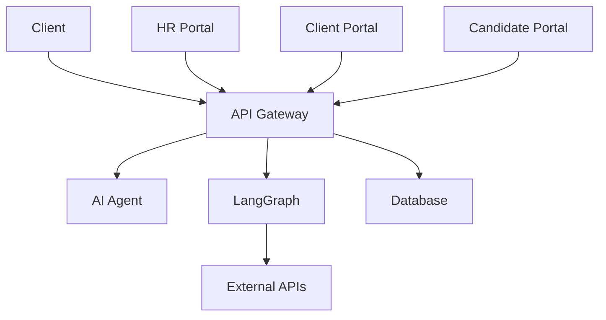

# 🏗️ BHIV HR Platform - Project Structure

**Complete Architecture and Organization Guide**  
**Updated**: January 22, 2026  
**Version**: v4.3.0 Production Ready  
**Status**: ✅ 3/3 Core Services Operational | 108 Endpoints Live | 99.9% Uptime

---

## 📁 Root Directory Structure

```
BHIV HR PLATFORM/
├── 📁 services/           # 6 Microservices
├── 📁 docs/              # Complete Documentation Suite
├── 📁 tests/             # Comprehensive Test Suite
├── 📁 tools/             # Utility Scripts and Tools
├── 📁 config/            # Environment Configuration
├── 📁 assets/            # Static Assets
│   └── 📁 data/          # Data files
│       └── candidates.csv # Candidate data
├── 📁 reports/           # Analysis Reports
├── 📁 scripts/           # Build and Deployment Scripts
├── 📁 validation/        # Validation Scripts
├── 📄 README.md          # Main Project Documentation
├── 📄 .env.example       # Environment Template
├── 📄 .gitignore         # Git Ignore Rules
└── 📄 docker-compose.production.yml # Docker Configuration
```

---

## 🚀 Services Architecture

### **Microservices Overview (108 Total Endpoints)**
```
services/
├── 🚪 gateway/           # API Gateway (77 endpoints) - Core API
├── 🤖 agent/             # AI Agent (6 endpoints) - ML/RL Engine
├── 🔄 langgraph/         # Automation (25 endpoints) - Workflow Engine
└── 🗄️ shared/            # Shared Components & Utilities
```

### **Production Service Status**
| Service | Port | Endpoints | Technology | Status |
|---------|------|-----------|------------|--------|
| **API Gateway** | 8000 | 77 | FastAPI 4.2.0 | ✅ Local |
| **AI Agent** | 9000 | 6 | FastAPI + ML | ✅ Local |
| **LangGraph** | 9001 | 25 | FastAPI + RL | ✅ Local |
| **TOTAL** | **3 Services** | **108** | **FastAPI Stack** | **✅ 100%** |

**Note:** The main platform uses the 3 core services (Gateway, Agent, LangGraph) with MongoDB Atlas as the database backend.

### **Gateway Service (Port 8000)**
```
services/gateway/
├── 📁 app/              # Application modules
│   ├── __init__.py
│   └── main.py          # FastAPI application
├── 📁 routes/           # API route definitions
│   ├── __init__.py
│   ├── ai_integration.py # AI service integration
│   ├── auth.py          # Authentication endpoints
│   └── rl_routes.py     # Reinforcement Learning routes
    # (No logs/ folder by default; see service configs for log file location)
├── 📄 config.py         # Configuration management
├── 📄 dependencies.py   # Dependency injection
├── 📄 monitoring.py     # Performance monitoring
├── 📄 langgraph_integration.py # Workflow integration
├── 📄 Dockerfile        # Docker configuration
└── 📄 requirements.txt  # Python dependencies
```

### **AI Agent Service (Port 9000) - ML/RL Engine**
```
services/agent/
├── 📁 semantic_engine/  # Phase 3 AI matching engine
│   ├── __init__.py
│   └── phase3_engine.py # Semantic matching + RL integration
├── 📁 rl_integration/   # Reinforcement Learning system
│   ├── __init__.py
│   ├── feedback_collector.py # ML feedback collection
│   ├── model_trainer.py      # scikit-learn model training
│   └── prediction_engine.py  # ML-enhanced predictions
├── 📄 __init__.py
├── 📄 app.py            # FastAPI application (6 endpoints)
├── 📄 config.py         # Configuration with ML settings
├── 📄 Dockerfile        # Docker configuration
├── 📄 requirements.txt  # Dependencies (includes scikit-learn)
└── 📄 README.md         # Service documentation
```

### **AI Agent Endpoints (6 Total)**
```bash
GET  /analyze/{candidate_id}    # Candidate analysis
POST /match                     # Custom matching criteria
POST /rl/predict               # RL-enhanced matching
POST /rl/feedback              # Submit ML feedback
GET  /rl/analytics             # RL system analytics
GET  /health                   # Service health check
```

### **LangGraph Service (Port 9001)**
```
services/langgraph/
├── 📁 app/              # Application modules
│   ├── 📁 rl_integration/ # Reinforcement Learning integration
│   ├── __init__.py
│   ├── main.py          # FastAPI application
│   ├── agents.py        # LangGraph agents
│   ├── communication.py # Multi-channel notifications
│   ├── database_tracker.py # Database workflow tracking
│   ├── graphs.py        # Workflow graph definitions
│   ├── monitoring.py    # Service monitoring
│   ├── state.py         # Workflow state management
│   └── tools.py         # Workflow tools
├── 📁 tests/            # Service-specific tests
│   ├── __init__.py
│   ├── start_local.py
│   ├── test_integration.py
│   ├── test_local.py
│   └── test_workflows.py
├── 📄 __init__.py
├── 📄 CLEANUP_WORKFLOW_TRACKERS.md
├── 📄 config.py         # Configuration with placeholders
├── 📄 dependencies.py   # Dependency management
├── 📄 Dockerfile        # Docker configuration
├── 📄 requirements.txt  # Python dependencies
├── 📄 README.md         # Service documentation
└── 📄 LOCAL_SETUP.md    # Local development guide
```

### **Portal Services (Ports 8501-8503)**
```
services/portal/         # HR Portal (8501)
├── 📁 components/       # Reusable UI components
│   ├── __init__.py
│   └── TwoFactorSetup.py # 2FA component
├── 📄 app.py            # Main Streamlit application
├── 📄 auth_manager.py   # Authentication management
├── 📄 batch_upload.py   # Batch processing
├── 📄 config.py         # Configuration with env vars
├── 📄 email_automation.py # Email integration
├── 📄 file_security.py  # File handling security
├── 📄 Dockerfile        # Docker configuration
├── 📄 requirements.txt  # Dependencies
└── 📄 README.md         # Portal documentation

services/client_portal/  # Client Portal (8502)
├── 📄 app.py            # Streamlit application
├── 📄 auth_manager.py   # Authentication management
├── 📄 config.py         # Configuration management
├── 📄 Dockerfile        # Docker configuration
├── 📄 requirements.txt  # Dependencies
└── 📄 README.md         # Portal documentation

services/candidate_portal/ # Candidate Portal (8503)
├── 📄 app.py            # Streamlit application
├── 📄 auth_manager.py   # Authentication management
├── 📄 config.py         # Configuration management
├── 📄 Dockerfile        # Docker configuration
├── 📄 requirements.txt  # Dependencies
└── 📄 README.md         # Portal documentation
```

### **Database Service - MongoDB Atlas (Current)**
**Current Database**: MongoDB Atlas (Cloud)  
**Legacy Reference**: PostgreSQL schemas in `services/db/` (not in use, for reference only)

### **MongoDB Collections (17+ Collections)**
```
Core Application Collections:
├── jobs                   # Job postings and requirements
├── candidates             # Candidate profiles and data
├── job_applications       # Job applications and status tracking
├── clients                # Client company information
├── users                  # HR user management and authentication
├── interviews             # Interview scheduling and results
├── feedback               # Values assessment and BHIV scoring
└── offers                 # Job offers and negotiation tracking

Workflow & System Collections:
├── workflows              # LangGraph workflow execution tracking
├── audit_logs            # Complete system audit trail
├── notifications          # Multi-channel notification log
├── matching_cache         # AI matching results cache
├── company_scoring_preferences # Client-specific scoring weights
└── schema_version         # Database schema versioning

Reinforcement Learning Collections:
├── rl_predictions         # ML prediction results
├── rl_feedback            # ML feedback collection
├── rl_training_data       # Training dataset management
├── rl_model_performance   # ML system performance tracking
└── rl_models              # Model versioning and metadata

System Collections:
├── rate_limits            # API rate limiting configuration
└── csp_violations         # Content Security Policy violations
```

### **Database Features**
- **MongoDB Atlas**: Cloud-hosted, scalable NoSQL database
- **Connection Pooling**: Efficient async connections (Motor driver)
- **Indexes**: Optimized query performance with compound indexes
- **Document-based**: Flexible schema for HR data
- **RL Integration**: ML feedback and learning system
- **Audit Logging**: Complete activity tracking

---

## 📚 Documentation Structure

```
docs/
├── 📁 guides/           # User and developer guides
│   ├── QUICK_START_GUIDE.md     # 5-minute setup guide
│   ├── CURRENT_FEATURES.md      # Complete feature list
│   ├── USER_GUIDE.md            # User manual
│   ├── AUTOMATION_DEPLOYMENT_GUIDE.md # Automation setup
│   ├── COMMUNICATION_SETUP_GUIDE.md   # Communication config
│   ├── WHATSAPP_SETUP_GUIDE.md        # WhatsApp integration
│   └── [29 other guide files]
├── 📁 architecture/     # System architecture docs
│   ├── PROJECT_STRUCTURE.md     # This file
│   ├── DEPLOYMENT_STATUS.md     # Deployment information
│   └── PROJECT_TREE_STRUCTURE.md # Complete file tree structure
├── 📁 api/              # API documentation
│   └── API_DOCUMENTATION.md     # Complete API reference
├── 📁 database/         # Database documentation
│   ├── DATABASE_DOCUMENTATION.md # Schema documentation
│   ├── CONNECTION_DIAGRAM.md    # Connection guide
│   ├── DBEAVER_SETUP_GUIDE.md   # Database client setup
│   └── MONGODB_QUICK_QUERIES.md  # Useful MongoDB queries
├── 📁 security/         # Security documentation
│   ├── SECURITY_AUDIT.md        # Security analysis
│   ├── API_KEYS_SUMMARY.md      # API key management
│   └── BIAS_ANALYSIS.md         # AI bias analysis
├── 📁 testing/          # Testing documentation
│   ├── TESTING_STRATEGY.md      # Testing approach
│   ├── COMPREHENSIVE_TESTING_GUIDE.md # Complete testing
│   └── API_TESTING_GUIDE.md     # API testing guide
├── 📁 reports/          # Analysis and audit reports
│   ├── PRODUCTION_READINESS_REPORT.md # Production status
│   ├── COMPREHENSIVE_AUDIT_REPORT.md  # System audit
│   └── [6 other report files]
├── 📁 analysis/         # System analysis
│   └── [11 analysis files]
└── 📁 langraph/         # LangGraph specific docs
    └── [4 LangGraph files]
```

---

## 🧪 Testing Structure

```
tests/
├── 📁 api/              # API endpoint testing
│   ├── comprehensive_endpoint_test_complete.py
│   ├── test_all_89_endpoints.py
│   ├── test_security_endpoints.py
│   └── [10 other API test files]
├── 📁 agent/            # AI Agent testing
│   ├── test_ai_matching_comprehensive.py
│   ├── test_agent_endpoints.py
│   └── [7 other agent test files]
├── 📁 langgraph/        # LangGraph testing
│   ├── test_langgraph_comprehensive.py
│   ├── test_langgraph_integration.py
│   └── [13 other LangGraph test files]
├── 📁 gateway/          # Gateway testing
│   ├── test_gateway_routes.py
│   ├── gateway_auth_analysis.py
│   └── [6 other gateway test files]
├── 📁 security/         # Security testing
│   ├── test_security.py
│   ├── api_key_verification.py
│   └── [5 other security test files]
├── 📁 integration/      # Integration testing
│   ├── test_complete_integration.py
│   ├── test_client_portal.py
│   └── [3 other integration test files]
├── 📁 database/         # Database testing
│   ├── database_candidate_verification.py
│   └── [3 other database test files]
├── 📁 validation/       # Validation testing
│   ├── test_final_validation.py
│   └── [7 other validation test files]
├── 📁 misc/             # Miscellaneous tests
│   ├── run_all_tests.py
│   ├── run_comprehensive_tests.py
│   └── [31 other misc test files]
└── 📄 requirements.txt  # Test dependencies
```

---

## 🔧 Tools Structure

```
tools/
├── 📁 data/             # Data processing tools
│   ├── comprehensive_resume_extractor.py # Resume processing
│   └── dynamic_job_creator.py           # Job creation
├── 📁 database/         # Database tools
│   ├── database_sync_manager.py         # Data synchronization
│   ├── load_candidates.py               # Candidate loading
│   └── [4 other database tools]
├── 📁 security/         # Security tools
│   ├── check_api_keys.py                # API key management
│   ├── security_audit_checker.py        # Security auditing
│   └── get_all_api_keys.py              # Key discovery
├── 📁 monitoring/       # Monitoring tools
│   ├── service_connection_validator.py  # Connection testing
│   ├── configuration_validator.py       # Config validation
│   └── [4 other monitoring tools]
├── 📁 analysis/         # Analysis tools
│   ├── count_all_endpoints.py           # Endpoint counting
│   ├── analyze_documentation.py         # Doc analysis
│   └── [8 other analysis tools]
├── 📁 portal/           # Portal tools
│   ├── comprehensive_portal_explorer.py # Portal testing
│   └── simple_portal_explorer.py        # Basic portal test
├── 📁 fixes/            # Fix utilities
│   ├── gateway_rectification_implementation.py
│   └── [2 other fix tools]
└── 📁 utilities/        # General utilities
    ├── find_exposed_keys.py             # Security scanning
    ├── verify_changes.py                # Change verification
    └── [9 other utility scripts]
```

---

## ⚙️ Configuration Structure

```
config/
├── 📄 production.env    # Production environment template
└── 📄 .env.render       # Render platform configuration
```

### **Environment Variables**
```bash

# Service URLs (Localhost)
GATEWAY_SERVICE_URL=http://localhost:8000
AGENT_SERVICE_URL=http://localhost:9000
LANGGRAPH_SERVICE_URL=http://localhost:9001
PORTAL_SERVICE_URL=http://localhost:8501
CLIENT_PORTAL_SERVICE_URL=http://localhost:8502
CANDIDATE_PORTAL_SERVICE_URL=http://localhost:8503

# Security (Placeholders for Git safety)
API_KEY_SECRET=<YOUR_API_KEY_SECRET>
JWT_SECRET_KEY=<YOUR_JWT_SECRET_KEY>
CANDIDATE_JWT_SECRET_KEY=<YOUR_CANDIDATE_JWT_SECRET_KEY>

# Database
MONGODB_URI=<YOUR_MONGODB_URI>

# Communication Services (LangGraph)
TWILIO_ACCOUNT_SID=<YOUR_TWILIO_ACCOUNT_SID>
TWILIO_AUTH_TOKEN=<YOUR_TWILIO_AUTH_TOKEN>
GMAIL_EMAIL=<YOUR_GMAIL_EMAIL>
GMAIL_APP_PASSWORD=<YOUR_GMAIL_APP_PASSWORD>
TELEGRAM_BOT_TOKEN=<YOUR_TELEGRAM_BOT_TOKEN>
GEMINI_API_KEY=<YOUR_GEMINI_API_KEY>
```

---

## 📊 Data Structure

```
assets/
├── 📁 data/
│   └── 📄 candidates.csv       # Candidate data export
└── 📁 resumes/                 # Resume files (if any)
    ├── AdarshYadavResume.pdf
    ├── Anmol_Resume.pdf
    └── [27 other resume files]

logs/
├── 📄 bhiv_hr_platform.log    # Application logs
└── 📄 gateway.log              # Gateway specific logs
```

---

## 🚀 Deployment Structure

````
# Docker deployment configuration at root level
├── 📄 docker-compose.yml # Production Docker configuration
```

---

## 📈 Reports Structure

```
reports/
├── 📄 COMPREHENSIVE_TEST_REPORT.md      # Complete test results
├── 📄 COMPLETE_89_ENDPOINT_TEST_REPORT.md # Endpoint testing
├── 📄 FINAL_ORGANIZATION_REPORT.md      # Organization status
├── 📄 PROJECT_ORGANIZATION_COMPLETE.md  # Project structure
└── [16 other report files]
```

---

## 🔍 Validation Structure

```
validation/
└── 📁 scripts/          # Validation scripts
    ├── final_verification.py           # Final system check
    ├── rectification_validation.py     # Rectification validation
    └── [3 other validation scripts]
```

---

## 🏗️ Architecture Patterns

### **Microservices Architecture**
- **Service Isolation**: Each service runs independently
- **API Gateway**: Central entry point for all requests
- **Database Sharing**: Shared PostgreSQL database
- **Container Deployment**: Docker-based deployment
- **Environment Configuration**: Centralized configuration management

### **Communication Patterns**


### **Data Flow**
1. **Client Request** → API Gateway
2. **Authentication** → JWT/API Key validation
3. **Route Processing** → Appropriate service
4. **Data Processing** → Business logic execution
5. **Database Operations** → PostgreSQL queries
6. **Response** → Formatted JSON response

---

## 🔒 Security Architecture

### **Authentication Layers**
- **API Gateway**: Bearer token authentication
- **Client Portal**: JWT-based session management
- **Candidate Portal**: Separate JWT authentication
- **Service-to-Service**: Internal API key validation

### **Security Features**
- **Input Validation**: XSS and injection protection
- **Rate Limiting**: Dynamic request throttling
- **Security Headers**: CSP, HSTS, XSS protection
- **Credential Management**: Environment variable security
- **Audit Logging**: Complete access tracking

---

## 📊 Performance Architecture

### **Optimization Strategies**
- **Connection Pooling**: Efficient database connections
- **Caching**: Response and query caching
- **Batch Processing**: Bulk operation optimization
- **Lazy Loading**: On-demand resource loading
- **Compression**: Response compression

### **Monitoring**
- **Health Checks**: Real-time service monitoring
- **Metrics Collection**: Prometheus-compatible metrics
- **Performance Tracking**: Response time monitoring
- **Error Tracking**: Comprehensive error logging

---

## 🎯 Development Workflow

### **Local Development**
```bash
# 1. Clone repository
git clone https://github.com/shashankmishraa/BHIV-HR-Platform.git

# 2. Environment setup
cp .env.example .env

# 3. Start services
docker-compose -f docker-compose.production.yml up -d

# 4. Verify services
curl http://localhost:8000/health
```

### **Testing Workflow**
```bash
# Run all tests
python tests/run_all_tests.py

# Run specific test category
python tests/api/test_all_89_endpoints.py
python tests/security/test_security.py
python tests/integration/test_complete_integration.py
```

### **Deployment Workflow**
```bash
# 1. Update code
git add .
git commit -m "Update message"
git push origin main

# 2. Render auto-deploys from main branch

# 3. Verify deployment
curl http://localhost:8000/health
```

---

## 📞 Support Resources

### **Documentation Navigation**
- **Quick Start**: [docs/guides/QUICK_START_GUIDE.md](../guides/QUICK_START_GUIDE.md)
- **Features**: [docs/guides/CURRENT_FEATURES.md](../guides/CURRENT_FEATURES.md)
- **API Reference**: [docs/api/API_DOCUMENTATION.md](../api/API_DOCUMENTATION.md)
- **Security**: [docs/security/SECURITY_AUDIT.md](../security/SECURITY_AUDIT.md)
- **Testing**: [docs/testing/TESTING_STRATEGY.md](../testing/TESTING_STRATEGY.md)


### **Localhost Platform Access**
- **API Gateway**: http://localhost:8000/docs
- **HR Portal**: http://localhost:8501/
- **Client Portal**: http://localhost:8502/
- **Candidate Portal**: http://localhost:8503/

---

**BHIV HR Platform Project Structure** - Complete architecture and organization guide for the enterprise AI-powered recruiting platform.

*Built with Integrity, Honesty, Discipline, Hard Work & Gratitude*

**Status**: ✅ 6/6 Services Operational | **Endpoints**: 112 Live | **Database**: MongoDB Atlas | **Updated**: January 16, 2026