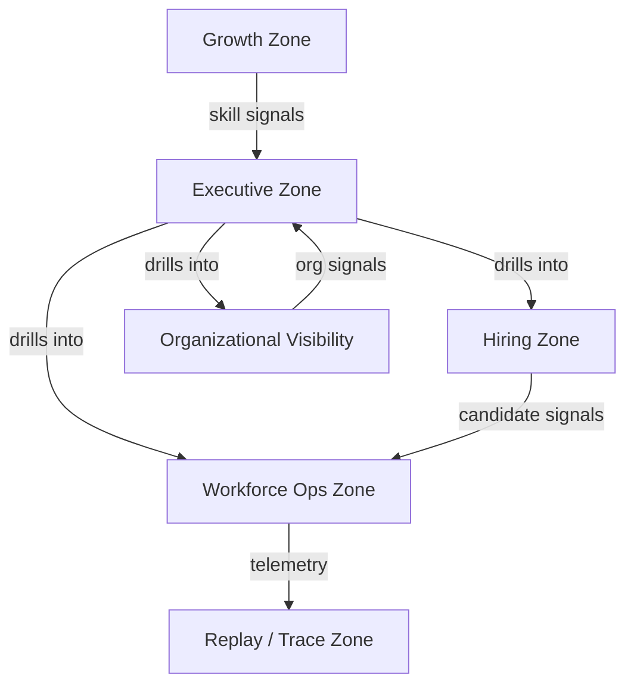

# SAMPADA Control Center Blueprint

Date: 2026-05-30
Prepared by: Support Builder (automation)

## Purpose
This document defines the Master Workforce Control Center (Control Center) for SAMPADA — a low‑scroll, high‑density operational dashboard designed for rapid situational awareness, decision support, and bounded operational control while preserving human‑centric guardrails.

## Cognition Principles
- Scan speed: present critical signals in a single glance.
- Hierarchy clarity: clear visual prioritization (alerts → issues → insights).
- Low‑scroll density: minimize vertical navigation; use zoned panels and progressive disclosure.
- Zoning discipline: separate Executive, Hiring, Workforce Ops, Growth, Org Visibility, and Replay/Trace zones.
- Action locality: actionable items link to exact workflow context; no bulk command surfaces that perform cross‑system execution without explicit owner consent.

## Dashboard Zones (Task18 — required surfaces)

- **Executive Zone** (low-scroll, high-density)
  - workforce health
  - hiring health
  - payroll state (visibility-only; Artha-owned)
  - escalations
  - open issues
  - operational risks
  - Key metrics: Workforce Health Index, active headcount, open roles, time-to-fill, payroll state flags, escalation count.

- **Hiring Zone**
  - candidate pipeline
  - recruiter visibility
  - interview state
  - onboarding state
  - Key metrics: pipeline counts by stage, interview velocity, recruiter load, onboarding readiness cues.

- **Workforce Operations Zone**
  - attendance state (aggregated participation visibility)
  - HR requests
  - complaints (privacy-bounded visibility)
  - appreciations
  - leave state
  - payroll cues (visibility participation ≠ ownership)
  - Key metrics: pending HR requests, SLA breaches, attendance anomalies (aggregated), reimbursement backlog.

- **Growth Zone**
  - learning visibility
  - mentorship visibility
  - growth trajectories
  - strengths mapping
  - Key metrics: learning completion rates, mentors/mentees active, skill trajectory heatmap (no individual ranking).

- **Organizational Visibility Zone**
  - department map
  - dependency map
  - staffing gaps
  - operational bottlenecks
  - Key metrics: dept load, critical role vacancies, cross-team dependency alerts.

- **Replay / Trace Zone**
  - audit trail
  - replay reconstruction
  - observability evidence
  - Key metrics: trace density, unreconciled events, last replay timestamp.

## Zone UX Constraints
- No surveillance widgets: all metrics derived from consented signals and participation flags.
- No gamification: remove leaderboard style presentation; emphasize constructive growth metrics.
- Visibility ≠ ownership: payroll visibility panels are read‑only and explicitly labeled.
- Progressive disclosure: details appear on demand; default views show aggregated, non‑PII metrics.

## Replay & Trace Hooks
- All actionable events must include `X-Correlation-Id` and `trace_id` fields for end‑to‑end trace reconstruction.
- Replay controls: import trace → simulate timeline → compare reconstructed state with persisted state. Provide diff view and export of evidence bundle.
- Telemetry retention: retain replay artifacts long enough for governance review, per policy (TBD by owners).

## Privacy & Boundary Protections
- Payroll visibility participation is explicitly opt‑in and only transmits hashed employee identifiers (no raw PII).
- Any payroll‑derived metric must be aggregated or reduced to non‑PII forms for display.
- Enforce role gating: only designated observer roles can open payroll visibility panels; actions remain read‑only.

## Implementation Notes
- Data sources: Gateway (API), Niyantran (execution telemetry), Artha (payroll visibility read endpoints), Logistics, CRM, SETU aggregator.
- Signal validation: validate incoming signals against JSON Schemas in `docs/schemas/` before display.
- Performance: render only top‑K slices and asynchronous detail fetch to keep executive view sub‑200ms.

## Acceptance Criteria (Phase 3 draft)
1. Control Center doc present at `docs/SAMPADA_CONTROL_CENTER_BLUEPRINT.md`.
2. Mermaid layout diagram included for design handoff.
3. UX constraints and replay hooks clearly specified.

## Detailed Design & Analysis

This section provides step‑by‑step design rationale, data mappings, and implementation guidance to convert the blueprint into a production‑ready Control Center while respecting the BHIV principles and Task18 guardrails.

### 1) Cognition Principles — design implications
- Scan speed: prioritize 3–5 critical KPIs in the Executive header. Use sparklines + single number + delta to communicate trend in one glance. Avoid dense tables on first glance.
- Hierarchy clarity: use progressive emphasis (color, size, position). Alerts (red) > Warnings (amber) > Info (neutral). Actions must be contextual and owner‑scoped.
- Low‑scroll density: keep the default executive view to a single screen height (desktop 1080p). Use horizontal card strips and modal/detail panels rather than stacking vertically.
- Zoning discipline: each zone has a single primary KPI, 3 secondary KPIs, and a contextual detail panel. Zones are navigable via top tabs or left rail quick jump.
- Operational cognition: provide causal breadcrumbs (what changed → why → who can act) and synthetic insights (combination of signals) rather than raw event streams.

### 2) Zone‑by‑Zone Detailed Metrics, Data Sources, and Schemas

- Executive Zone
  - Primary KPI: Workforce Health Index (composite score). Secondary: Open Roles, Time‑to‑Fill, Payroll State Summary.
  - Data sources: aggregates from Gateway endpoints (`/v1/stats/overview`), Artha payroll visibility read endpoint (hashed ID aggregated), SETU aggregator.
  - Display: KPI strip, anomaly indicator, top 3 attention items.

- Hiring Zone
  - Primary KPI: Pipeline Velocity (avg days/stage). Secondary: Top mismatched roles, Interview Velocity, Recruiter Load.
  - Data sources: Gateway `/v1/match/*`, recruitment pipelines `/v1/jobs`, recruiter activity logs.
  - Example payload shape: `GET /v1/dashboard/hiring?tenant_id={t}` returns { pipeline:{sourcing:12,screening:6,interview:3,offer:1}, velocity:{avg_days:18} }

- Workforce Operations Zone
  - Primary KPI: Operational SLA Health (pending HR requests older than SLA). Secondary: Attendance anomalies, Leave balance alerts, Reimbursement backlog.
  - Data sources: HR requests `/v1/hr/requests`, attendance aggregator, payroll participation flags.

- Growth Zone
  - Primary KPI: Growth Momentum (learning completion × engagement). Secondary: Mentorship activity, Skill trajectory heatmap.
  - Data sources: LXP integrations, mentorship logs, learning event telemetry.

- Organizational Visibility Zone
  - Primary KPI: Staffing Gap Score (vacancies × criticality). Secondary: Cross‑team dependency risk index, team load heatmap.
  - Data sources: org chart service, job postings, SETU dependency map.

- Replay / Trace Zone
  - Purpose: fast access to audit traces and deterministic replay controls.
  - Data sources: execution telemetry (`/v1/telemetry/trace/{trace_id}`), audit logs, evidence store.
  - Minimal trace schema: { trace_id, correlation_id, events:[{ts, service, op, payload_hash}], snapshot_refs:[db_oid] }

### 3) Replay & Trace Technical Spec
- Correlation model: every external and internal request must include `X-Correlation-Id` and `trace_id` (UUIDv4). `correlation_id` groups related user flows; `trace_id` identifies a single execution instance.
- Trace ingestion: Gateway attaches `received_ts` and forwards `X-Correlation-Id` to downstream services. Services must store trace fragments in `execution_telemetry` collection with index on `trace_id` and `correlation_id`.
- Replay API (suggested):
  - `POST /v1/replay/prepare` { trace_id } → returns replay_bundle_id
  - `POST /v1/replay/run` { replay_bundle_id, options } → returns replay_run_id and status
  - `GET /v1/replay/status/{replay_run_id}` → result and diff artifact link
- Evidence bundle: include request/response pairs, DB snapshots (ids), and replay logs. Provide export as gzipped JSON for governance review.

### 4) Privacy, Guardrails, and Anti‑patterns
- Payroll visibility: accept only hashed identifiers (schema in `docs/schemas/payroll_visibility.json`). Display payroll cues only as aggregated flags (e.g., `payroll_participation: true`, `payroll_state: calculated`). Never display raw payroll amounts unless explicitly permitted and role‑gated.
- No surveillance: remove or hide individual productivity metrics; prefer team‑level aggregated signals with clear consent provenance.
- No gamification: disallow leaderboards or ranking metrics that could be used for coercive behaviors.

### 5) Implementation Checklist (developer handoff)
1. Add backend telemetry endpoints if missing: `/v1/dashboard/overview`, `/v1/telemetry/trace/{id}`, `/v1/replay/*`.
2. Implement schema validation pipeline for incoming signals using existing JSON Schemas in `docs/schemas/`.
3. Build frontend skeleton: top rail (zone nav), executive header, zone containers (card grid), modal detail viewer for traces.
4. Ensure access control: extend Gateway RBAC to include `observer:payroll_view` role for payroll panels.
5. Implement replay orchestration worker to build replay bundles and run simulations in isolation.
6. Add automated tests: schema validation, trace propagation, and access control tests.

### 6) Prototype guidance (minimal viable view)
- Deliverable: single‑screen React page showing Executive Zone + one drilldown into Hiring Zone and a Replay panel. Use server‑side aggregation endpoints to limit data volume.
- Tech: reuse `frontend/src/services/api.ts` to call `/v1/dashboard/overview`. Keep components stateless; fetch details on demand.

### 7) Acceptance Criteria (expanded)
1. Executive view renders under 200ms with production‑like dataset (top 5 KPIs).  
2. Trace replay can be prepared and executed producing a diff artifact within allowed resource limits.  
3. Payroll visibility panels return aggregated, non‑PII views and require `observer:payroll_view` permission.  
4. UX respects low‑scroll and zoning constraints — default render fits a single desktop viewport without vertical overflow.

### 8) Testing & Validation Plan
- Unit tests: schema validators for telemetry and payroll visibility.  
- Integration tests: end‑to‑end flow that creates job → triggers match → records trace → performs replay and validates final state.  
- Security tests: RBAC enforcement and privacy tests for payroll data.

## Next Steps
- Implementation sprint plan: 3 sprints (prototype → integration → hardened release).  
- Book review with product owner and stakeholders to validate KPI definitions and role gating.  
- After approval, create PRs and attach sample screenshots and replay artifacts to `CONTRIBUTION_LOG.md`.

## Mermaid Zone Layout

## Next Steps
- Review with product owner (Rishabh Yadav) for approval.  
- Wire prototype (`frontend/src/pages/control/ControlCenter.tsx`) to live `/v1/dashboard/*` endpoints when approved.  
- Coordinate with owners to surface replay hooks and sample telemetry for integration tests.

---
**Links**: [SAMPADA_SETU_CONVERGENCE_MAP.md](SAMPADA_SETU_CONVERGENCE_MAP.md) · [docs/schemas/](../schemas/) · [ControlCenter.tsx](../../frontend/src/pages/control/ControlCenter.tsx)
