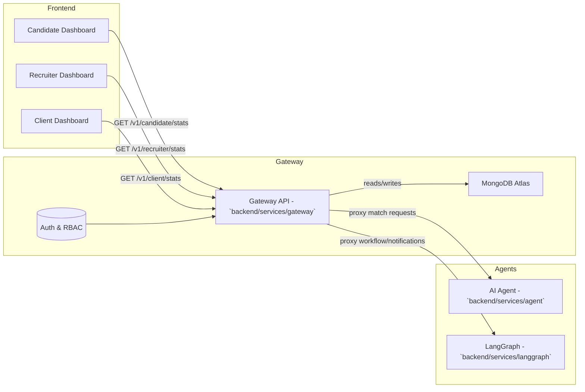

## SAMPADA_WORKFORCE_OS_ARCHITECTURE

Status: Draft

Owner: Rishabh Yadav (authority and sign-off required)

Purpose:
- Map Sampada's evolution into a Talent Intelligence + Workforce OS and tie architecture layers to concrete repo components.

1. Executive Summary
- Sampada will evolve into a layered Workforce OS supporting Talent Intelligence, Workforce Operations, Growth & Development, and Workforce Observability while preserving strict human-centric guardrails.

2. Layer Capability Map (Task18 — explicit scope)

### Talent Intelligence Layer

| Capability | Description | Repo / Implementation |
|------------|-------------|---------------------|
| Candidates | Candidate profiles, applications, semantic matching | `frontend/src/pages/candidate/`, Gateway `/v1/candidates`, `/v1/candidate/*` |
| Recruiters | Recruiter console, job management, applicant review | `frontend/src/pages/recruiter/`, Gateway `/v1/recruiter/*` |
| Hiring pipeline | Stage progression: apply → review → shortlist → interview → offer | `job_applications`, LangGraph webhooks |
| Interview systems | Interview scheduling and state visibility | `interviews` collection, recruiter workflows |
| NDA visibility | NDA status and document visibility (read-only) | Planned; visibility-only — no execution authority |
| Onboarding intelligence | Post-offer onboarding signals and readiness cues | LangGraph notifications; planned onboarding dashboard zone |

**Primary components**: `backend/services/agent/` (port 9000), `frontend/src/pages/candidate/`, `frontend/src/pages/recruiter/`.

### Workforce Operations Layer

| Capability | Description | Repo / Implementation |
|------------|-------------|---------------------|
| Employee profiles | Employee record visibility | MongoDB `users` / planned `employee_profiles` |
| Payroll visibility participation | Payroll state cues only — **not ownership** | Artha-owned; Sampada read-only via `payroll_visibility` schema |
| Attendance participation visibility | Aggregated attendance cues | Planned HR ops endpoints |
| Leave systems | Leave request visibility and state | Planned `/v1/hr/leave` |
| Reimbursements | Reimbursement backlog visibility | Planned `/v1/hr/reimbursements` |
| HR requests | HR request queue and SLA visibility | Planned `/v1/hr/requests` |
| Complaints | Complaint intake visibility (privacy-bounded) | Planned HR ops module |
| Appreciations | Recognition and appreciation signals | Entity: `Appreciation` in data model |
| Policy acknowledgements | Policy read/ack status visibility | Entity: `PolicyAcknowledgement` |

**Primary components**: `backend/services/gateway/` (port 8000), MongoDB collections.

### Growth & Development Layer

| Capability | Description | Repo / Implementation |
|------------|-------------|---------------------|
| Learning progress | Module completion, certifications | Planned LXP integration; Growth Zone in Control Center |
| Skills evolution | Skill trajectory over time | Human Growth Model § Dimension 2, 6 |
| Mentorship visibility | Active mentor–mentee relationships | Growth Zone; voluntary session logs |
| Aspirations | Career goals (confidential, employee-initiated) | `SAMPADA_HUMAN_GROWTH_MODEL.md` § Dimension 7 |
| Strengths mapping | Strengths profile (self vs baseline) | Planned personal growth map UI |
| Growth tracking | Trajectory direction and velocity | Control Center Growth Zone; no cross-employee ranking |

**Primary components**: `frontend/src/pages/`, `backend/services/langgraph/` (port 9001).

### Workforce Observability Layer

| Capability | Description | Repo / Implementation |
|------------|-------------|---------------------|
| Organizational visibility | Department and org structure visibility | Org Visibility Zone; SETU aggregator |
| Team load visibility | Team capacity and load signals (aggregated) | Control Center Org Zone |
| Bottlenecks | Process and staffing bottlenecks | Observability signals; SETU correlation |
| Workforce risk signals | Risk flags (staffing, SLA, dependency) | Executive Zone escalations |
| Staffing signals | Vacancy and gap indicators | Staffing Gap Score in blueprint |
| Operational health | Composite workforce health index | Executive Zone primary KPI |

**Primary components**: `evidence/`, `evidence/replay/replay_script.js`, Gateway + LangGraph telemetry.

### Executive Workforce Control Center

| Principle | Requirement |
|-----------|-------------|
| Layout | Low-scroll, high-density, operational cognition optimized |
| Implementation | `frontend/src/pages/control/ControlCenter.tsx`, blueprint at `docs/SAMPADA_CONTROL_CENTER_BLUEPRINT.md` |
| Guardrails | No surveillance widgets, no gamification, no execution authority from dashboard |

3. Architecture Overview (layer → repo mapping)

- **Talent Intelligence Layer** — see §2 Talent Intelligence Layer table.
- **Workforce Operations Layer** — see §2 Workforce Operations Layer table.
- **Growth & Development Layer** — see §2 Growth & Development Layer table.
- **Workforce Observability Layer** — see §2 Workforce Observability Layer table.
- **Executive Workforce Control Center** — see §2 Executive Control Center table.

4. Data Model & Key Entities
- Key entities: `Candidate`, `Recruiter`, `JobPosting`, `Interview`, `EmployeeProfile`, `PayrollRecord` (visibility-only), `AttendanceRecord`, `LeaveRequest`, `Reimbursement`, `HRRequest`, `Appreciation`, `PolicyAcknowledgement`, `LearningRecord`.
- Persistence: MongoDB collections managed by backend services; schemas located alongside service models (search `backend/services/**` for model definitions).

Reference Implementations & Files:
- MongoDB collection definitions and schemas: `backend/docs/database/MONGODB_COLLECTIONS.md` and `backend/docs/database/DATABASE_DOCUMENTATION.md`.
- Replay and trace tooling: `evidence/replay/replay_script.js`, `evidence/trace-continuity/`.

Frontend Dashboard References:
- Candidate Dashboard: `frontend/src/pages/candidate/Dashboard.tsx`
- Recruiter Dashboard: `frontend/src/pages/recruiter/Dashboard.tsx`
- Client Dashboard: `frontend/src/pages/client/ClientDashboard.tsx`
- Dashboard stats and API clients: `frontend/src/services/api.ts` (DashboardStats interfaces and `getCandidateDashboardStats`).

These frontend components already implement lightweight dashboard tabs and calls to Gateway stats endpoints; use these as the starting point for Executive Workforce Control Center wireframes and data requirements.

5. Integration Points & APIs
- Internal: Gateway exposes core APIs on `http://localhost:8000` (triple-layer auth). Agent service provides semantic matching on `:9000`. LangGraph provides workflow automation on `:9001`.
- External: Downstream integrations (Complete-Infiverse / EMS) defined in integration configs and `evidence/entry-points/` examples. Use `docs/SAMPADA_SETU_CONVERGENCE_MAP.md` to enumerate signal contracts.

Example Gateway API Endpoints (discovered in `backend/services/gateway/routes`):
- `POST /test-communication` — proxy to LangGraph test communication endpoints (email/whatsapp/telegram).
- `POST /gemini/analyze` — invoke Gemini analysis (if GEMINI_API_KEY configured).
- `POST /rl/predict` — proxy RL prediction to LangGraph.
- `POST /rl/feedback` — submit RL feedback to LangGraph.
- `GET /rl/analytics` — fetch RL analytics from LangGraph.
- `GET /rl/performance` — fetch RL performance metrics from LangGraph.

These are candidate endpoints for the Talent Intelligence layer to surface match and analytics data.

6. Security, Privacy & Guardrails
- Constitutional alignment (see README) mandates read-only intelligence for control surfaces; no conversion of intelligence into execution authority.
- Authentication & RBAC: enforced at Gateway (`backend/services/gateway/`) via API Key and JWT layers. All analytics must be privacy-preserving and bounded.

7. Implementation Impact (modules & paths)
- Files/paths to review when implementing features:
   - `backend/services/gateway/` — API routing, auth, tenant isolation
   - `backend/services/agent/` — semantic matching, AI models
   - `backend/services/langgraph/` — workflow automation, notifications
   - `frontend/src/` — dashboard and portal UI
   - `evidence/` — replay and trace artifacts for observability

8. Next Steps & TODOs
- Extract concrete API endpoints and model definitions; annotate this document with exact filenames and code references.
- Produce diagrams (mermaid or PNG) showing data flow between services and SETU partners.

TODO: Review with lead (Rishabh) and iterate; link specific model files and API endpoint paths in the next revision.

9. Frontend → Gateway Endpoint Mapping (key dashboard flows)

- Candidate Dashboard calls:
   - `GET /v1/candidate/stats/{candidate_id}` — implemented in `backend/services/gateway/app/main.py` (`@app.get("/v1/candidate/stats/{candidate_id}")`). Frontend: `frontend/src/pages/candidate/Dashboard.tsx` and `frontend/src/services/api.ts` (`getCandidateDashboardStats`).
   - `GET /v1/candidate/applications/{candidate_id}` — candidate applications endpoint used by candidate dashboard.

- Recruiter Dashboard calls:
   - `GET /v1/recruiter/stats` — implemented in `backend/services/gateway/app/main.py` (`@app.get("/v1/recruiter/stats")`). Frontend: `frontend/src/pages/recruiter/Dashboard.tsx` and `frontend/src/services/api.ts` (`/v1/recruiter/stats`).
   - `GET /v1/recruiter/jobs` — recruiter job list for dashboard (`@app.get("/v1/recruiter/jobs")`).

- Client Dashboard calls:
   - `GET /v1/client/stats` — client dashboard stats implemented at `@app.get("/v1/client/stats")` in gateway. Frontend: `frontend/src/pages/client/ClientDashboard.tsx`.
   - `GET /v1/match/{job_id}/top` — AI matching for job top candidates (`@app.get("/v1/match/{job_id}/top")`) proxied to Agent Service.

- AI & Matching:
   - `GET /v1/match/{job_id}/top` and `POST /v1/match/batch` — Gateway AI Matching Engine endpoints (implemented in `backend/services/gateway/app/main.py`) that call Agent Service (`backend/services/agent/`) with configurable `AGENT_MATCH_TIMEOUT`.

- Notifications & LangGraph integration:
   - `POST /test-communication` and `/rl/*` endpoints in `backend/services/gateway/routes/` proxy to LangGraph (`backend/services/langgraph/` or external LangGraph URL).

Addendum: Use `backend/handover/api_contract/API_CONTRACT_PART2.md` and `backend/handover/api_contract/API_CONTRACT_PART3.md` for canonical API contracts and payload examples.

10. Data Flow (high level)



11. Example Payloads

- Top Matches: `GET /v1/match/{job_id}/top?limit=5`

   - Example curl request:

      ```bash
      curl -H "Authorization: Bearer $API_KEY" "http://localhost:8000/v1/match/679a1b2c3d4e5f6789012345/top?limit=5"
      ```

   - Example response (200):

      ```json
      {
         "job_id": "679a1b2c3d4e5f6789012345",
         "limit": 5,
         "candidates": [
            {
               "candidate_id": "60a7c2e5f1e4a2b3c4d5e6f7",
               "candidate_name": "Priya Singh",
               "email": "priya@example.com",
               "match_score": 92.3,
               "skills_match": 0.88,
               "experience_match": 0.9,
               "location_match": 0.75,
               "matched_skills": ["Python","FastAPI","MongoDB"],
               "missing_skills": ["Kubernetes"],
               "recommendation": "Strong candidate — recommend interview"
            }
         ],
         "algorithm_version": "2.0.0-gateway-fallback",
         "agent_status": "ok"
      }
      ```

- Recruiter Stats: `GET /v1/recruiter/stats`

   - Example curl request:

      ```bash
      curl -H "Authorization: Bearer $RECRUITER_JWT" "http://localhost:8000/v1/recruiter/stats"
      ```

   - Example response (200):

      ```json
      {
         "total_jobs": 12,
         "total_applicants": 458,
         "shortlisted": 73,
         "interviewed": 42,
         "offers_sent": 8,
         "hired": 5,
         "assessments_completed": 112
      }
      ```

Notes:
- Use these canonical payload shapes when designing Control Center panels and API aggregation endpoints. Respect privacy and data minimization; redact PII where dashboards only need aggregate signals.


